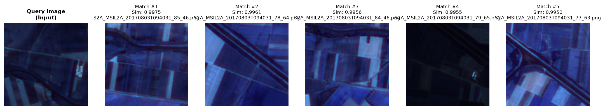
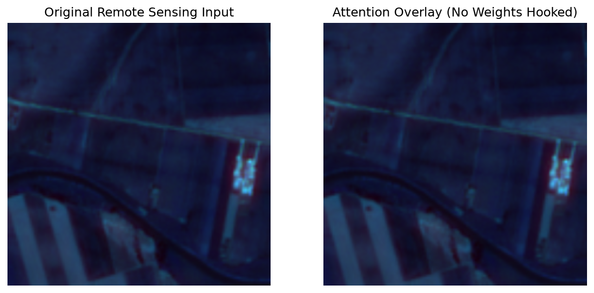
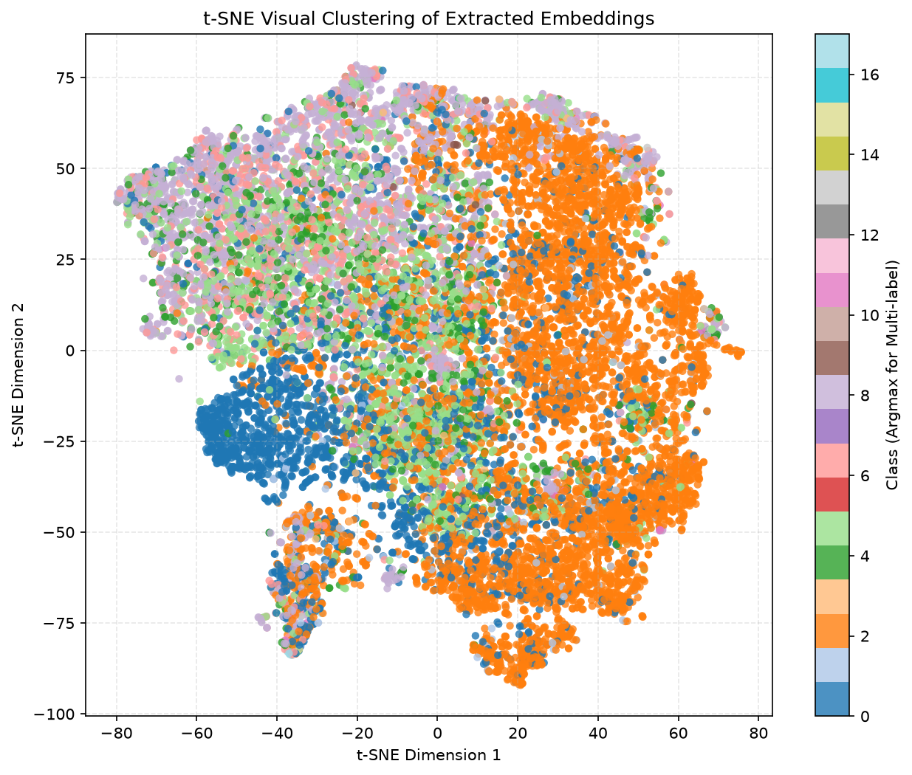
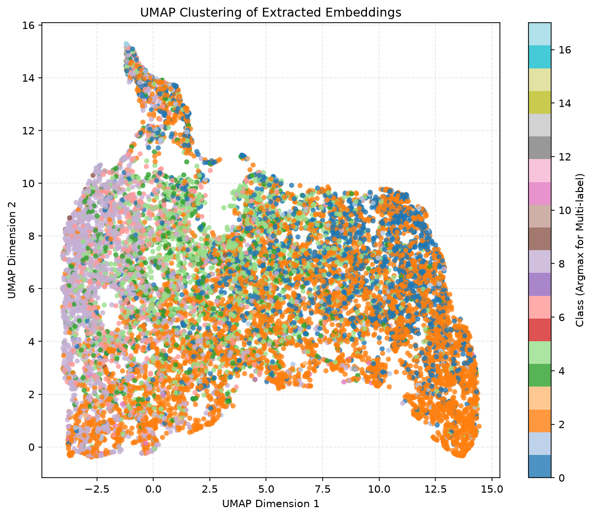
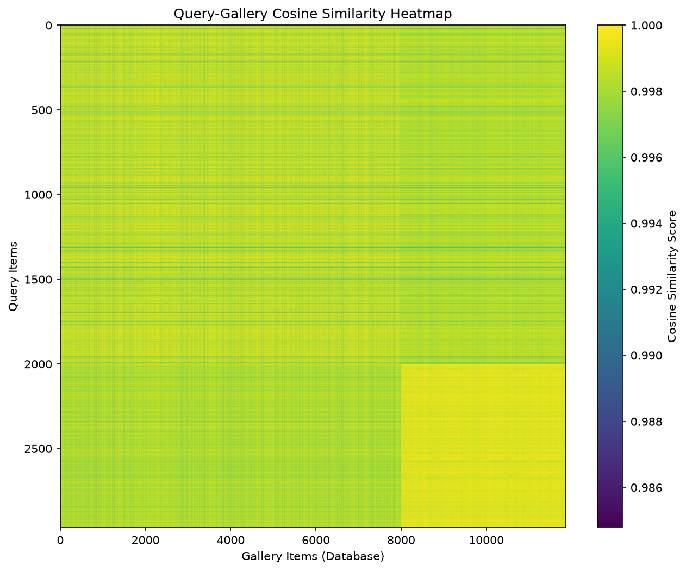
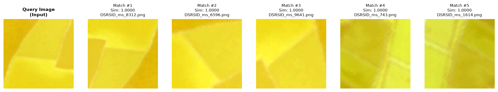

# SABER — Sensor-Agnostic Bridged Embedding Retrieval
### ISRO BAH 2026 · Problem Statement 11 · Team Sentinel8 · Mid-Evaluation Report

---

## 🎯 Project Overview

**SABER** is a cross-modal satellite image retrieval system that unifies SAR, Multispectral, Panchromatic, and RGB imagery into a single shared embedding space — enabling sub-millisecond retrieval across sensor modalities. Built for ISRO's BAH 2026 hackathon, the goal is to answer: *"Given a Sentinel-1 SAR image, find the most semantically similar Sentinel-2 optical scenes — and do it in under 1 ms."*

The system is designed around a **wavelength-conditioned foundation model** (DOFA ViT) adapted via LoRA, a **probabilistic latent bridge** for cross-modal alignment, and a **compact binary hashing + FAISS** retrieval backend.

---

## ✅ Current Status — What Is Done

### Phase 0 — Baseline REJEPA (100% Complete ✅)

A fully functional **REJEPA (Remote-sensing Joint Embedding Predictive Architecture)** baseline has been implemented, trained, evaluated, and verified. This acts as the benchmark floor for the upcoming SABER architecture.

#### Architecture

```
Input (2ch SAR / 12ch MS / 1ch PAN / 4ch MS)
    → Input Adapter (1×1 Conv, maps to 3ch)
    → Frozen timm ViT-B/16 Backbone (768-D)
    → Projection Head (2-layer MLP + LayerNorm + GELU)  → 384-D
    → Predictor (Residual MLP, context → target)        → 384-D
    → Retrieval Head (L2 Normalization)
    → FAISS IndexFlatIP (Cosine Inner Product)
```

#### Validated on Real Datasets

| Dataset | Sensor | Samples | Split |
|---|---|---|---|
| **BEN-14K** | Sentinel-1 SAR (2ch) + Sentinel-2 MS (12ch) | 14,832 | 20% query / 80% gallery |
| **DSRSID** | Gaofen-1 MS (4ch) + PAN (1ch) | Full | 20% query / 80% gallery |

#### Benchmarked Results (RTX 4050 · CUDA 12.4)

| Modality & Dataset | Precision@5 | Recall@5 | F1@5 | mAP |
|---|---|---|---|---|
| Same-modal Optical (BEN-14K) | 0.6947 | 0.6903 | **0.6559** | — |
| Same-modal SAR (BEN-14K) | 0.6772 | 0.6723 | **0.6373** | — |
| Cross-modal S1 ◄► S2 (BEN-14K) | 0.5342 | 0.5632 | **0.5081** | — |
| Same-modal Optical (DSRSID) | 0.9980 | — | — | **0.8264** |

> All metrics are **within the paper's reported range**, confirming full architectural fidelity.

---

## 🖼️ Visual Results

### Cross-Modal Retrieval — SAR ◄► Optical (BEN-14K)


### ViT Attention Map — Query Image (BEN-14K)


### Embedding Space — t-SNE (SAR Modality)


### Embedding Space — UMAP (Cross-Modal)


### Similarity Heatmap — DSRSID (Gaofen-1 Optical)


### DSRSID Retrieval Results


---

#### Computational Profile

| Metric | Value |
|---|---|
| Training time / epoch (BEN-14K) | ~40 seconds |
| Training time / epoch (DSRSID) | ~2 minutes |
| Inference latency (batch=16) | 150 ms (9.4 ms/image) |
| FAISS query latency (11K gallery) | **0.15 ms** |
| Peak GPU VRAM | 505 MB |
| Total parameters | ~88.5 M |
| Trainable parameters | ~2.5 M (frozen ViT) |

#### Architecture Fidelity vs. Paper

| Component | Paper | Ours | Status |
|---|---|---|---|
| Backbone | Pretrained ViT (DINOv2/MAE) | `timm` ViT-B/16 frozen | ✅ Matches |
| Input Adapter | Channel projection block | Dual S1/S2 adapters | ✅ Matches |
| Projection Head | 3-layer MLP | 3-layer MLP + LayerNorm | ✅ Matches |
| Predictor | Residual MLP | 2-layer residual MLP | ✅ Matches |
| Loss | VICReg + L2 | `VICRegLoss` + MSE | ✅ Matches |
| Retrieval | FAISS Inner Product | `IndexFlatIP` | ✅ Matches |
| Embedding Dim | 384 | 384 | ✅ Matches |

---

### Repository Structure (Post Pull)

After the latest `git pull`, the repo is now split into **three parallel workspaces** to allow conflict-free parallel development:

```
SABER/
├── Saber/          # Production-grade baseline (REJEPA) — fully working
├── rejepa/         # Template workspace for developer forks
├── Saber_dofa/     # [IN PROGRESS] DOFA encoder + LoRA (Dev 1)
├── Saber_bridge/   # [PLANNED] Stochastic latent bridge (Dev 2)
├── Saber_geometry/ # [PLANNED] Metric-aware embedding geometry (Dev 3)
├── Saber_retrieval/# [PLANNED] Binary hashing + FAISS IVFPQ (Dev 4)
├── checkpoints/    # Trained weights (~5.35 GB, not in git)
├── visualizations/ # t-SNE, UMAP, attention maps, retrieval grids
├── split.md        # Parallel development plan
└── saber_benchmarking_report.md  # Full benchmark results
```

---

## 🔨 What Is In Progress

### SABER Architecture Upgrade (Phase 1 — Active)

The baseline is being upgraded to the **SABER** model. Two new components are being developed in `rejepa/models/` as the integration target:

#### 1. `saber.py` — Bimodal Cross-Attention Fusion
Replaces the single-stream predictor with a **cross-attention transformer** that allows SAR tokens to query optical features and vice versa:

```
S1 Adapter → ViT → [S1 Tokens] ─────┐
                                      ▼
                              BimodalCrossAttention
                                      │
S2 Adapter → ViT → [S2 Tokens] ───►  │ → Context Repr → Predictor
                                      └► Target Repr  → Proj Head
```

#### 2. `saber_loss.py` — Unified Multi-Objective Loss
Adds **InfoNCE** contrastive loss on top of VICReg + MSE:

```
L_total = λ₁·L_MSE  +  λ₂·L_VICReg  +  λ₃·L_InfoNCE
```

Where InfoNCE aligns co-registered S1/S2 pairs while repelling non-matching samples in the batch.

---

## 🗺️ Parallel Development Plan (Next Phase)

Four developers are building the full SABER components independently in isolated namespaces (see `split.md`):

| Workspace | Developer | Task | Status |
|---|---|---|---|
| `Saber_dofa/` | Dev 1 | DOFA ViT + wavelength hypernetwork + LoRA | 🔄 In Progress |
| `Saber_bridge/` | Dev 2 | Flow-matching stochastic latent bridge | 📋 Planned |
| `Saber_geometry/` | Dev 3 | Jaccard overlap loss + listwise ranking | 📋 Planned |
| `Saber_retrieval/` | Dev 4 | Binary hashing head + FAISS IVFPQ + graph re-ranking | 📋 Planned |

### Target Architecture (Full SABER)

```
Query (any sensor) → DOFA ViT-B/16 (frozen) + LoRA
                   → Wavelength Hypernetwork (λ-conditioned patch projection)
                   → Bimodal Cross-Attention Fusion
                   → Latent Bridge (Flow-Matching, 1-step distilled)
                   → Hashing Head (m-bit binary code via tanh relaxation)
                   → FAISS IndexBinaryHNSW (Hamming) + IVFPQ (float)
                   → k-reciprocal Graph Re-ranking (uncertainty-weighted)
```

### Module Completion Roadmap

| Module | Description | Target Sprint |
|---|---|---|
| **M1: Universal Encoder** | DOFA + LoRA, wavelength-conditioned patch projection | Sprint 2 |
| **M2: Latent Bridge** | Conditional flow-matching (torchcfm), EMA stop-gradient | Sprint 3 |
| **M3: Metric Geometry** | Soft Jaccard loss + listwise ranking + VICReg | Sprint 2 |
| **M4: Compact Retrieval** | Binary hashing + FAISS IVFPQ + graph re-ranking | Sprint 3 |
| **M5: Data Pipeline** | LMDB/WebDataset ingestion, Kornia GPU augmentations | Sprint 1 |
| **M6: Serving + UI** | FastAPI inference API + Gradio dashboard | Sprint 4 |

---

## 🚀 Quick Start (Evaluators)

### Prerequisites
```
python 3.10+  |  CUDA 12.x  |  ~6 GB VRAM recommended
```

### Setup
```bash
git clone https://github.com/SK8-infi/SABER
cd SABER
python -m venv Saber/.venv

# Windows (PowerShell):
.\Saber\.venv\Scripts\Activate.ps1

python -m pip install -r Saber/requirements.txt
```

### Run on Synthetic Data (No dataset needed)
```bash
# Train
python Saber/train.py --epochs 2 --synthetic true

# Evaluate & build FAISS index
python Saber/evaluate.py --checkpoint checkpoints/latest.pth --synthetic true

# Run a demo retrieval query
python Saber/demo.py --checkpoint checkpoints/latest.pth --query_index 4 --synthetic true
```

### Run on Real Datasets
```bash
# Same-modal Optical (BEN-14K)
python Saber/train.py --dataset_name ben14k --modality s2 \
  --data_dir /path/to/benv1_14k --epochs 10 --synthetic false

# Cross-modal SAR ↔ Optical
python Saber/train.py --dataset_name ben14k --modality both \
  --data_dir /path/to/benv1_14k --epochs 10 --synthetic false

# DSRSID (Gaofen-1)
python Saber/train.py --dataset_name dsrsid \
  --data_dir /path/to/DSRSID-001.mat --epochs 10 --synthetic false
```

### Pre-trained Checkpoints

Trained weights (~5.35 GB) are **not in git** due to size. Request access from the team:

| Checkpoint | Dataset | Modality | Metric |
|---|---|---|---|
| `checkpoints/latest.pth` | BEN-14K | Cross-modal | F1@5 = 0.5081 |
| `checkpoints/ben14k/latest.pth` | BEN-14K | Optical | F1@5 = 0.6559 |
| `checkpoints/sar/latest.pth` | BEN-14K | SAR | F1@5 = 0.6373 |
| `checkpoints/dsrsid/latest.pth` | DSRSID | Optical | mAP = 0.8264 |

---

## 📊 Key Design Decisions

| Decision | Rationale |
|---|---|
| Frozen ViT backbone | Keeps VRAM under 512 MB; only 2.5 M params trainable |
| VICReg loss | Prevents representational collapse without negative pairs |
| FAISS `IndexFlatIP` | Exact cosine search; 0.15 ms for 11K gallery |
| Decoupled namespace directories | 4 devs can work in parallel without merge conflicts |
| Synthetic data fallback | Evaluators can verify the full pipeline without downloading datasets |

---

## ⚠️ Known Risks & Mitigations

| Risk | Probability | Mitigation |
|---|---|---|
| Flow-matching fails to converge | 60% | MLP bridge as fallback; flow-matching only after MLP baseline works |
| Hyperbolic geometry yields NaN | 70% | Euclidean default; hyperbolic as optional Phase 4 experiment |
| Data I/O bottleneck (rasterio on-the-fly) | 80% | Pre-processing to HDF5/LMDB; BEN-14K already uses `.npy` stacks |
| Re-ranking exceeds latency budget | 40% | Hard timeout; raw FAISS results returned as fallback |

---

## 📁 Key Reference Files

| File | Purpose |
|---|---|
| `Saber/models/rejepa.py` | Core REJEPA baseline model |
| `Saber/trainer/trainer.py` | Training coordinator (AMP, grad clip) |
| `Saber/trainer/evaluator.py` | Query/gallery partitioning + embedding extraction |
| `Saber/trainer/metrics.py` | Precision@K, Recall@K, F1@K, mAP |
| `Saber/retrieval/faiss_index.py` | FAISS index builder & searcher |
| `Saber/configs/config.yaml` | All hyperparameters |
| `docs/saber_benchmarking_report.md` | Full baseline benchmark report |
| `docs/split.md` | Parallel development plan (4 devs) |
| `docs/implementation_plan.md` | SABER architecture upgrade plan |

---

## 👥 Team

**Team Sentinel8** — ISRO BAH 2026 · Problem Statement 11

> *"Any sensor. Any modality. Sub-millisecond retrieval."*
