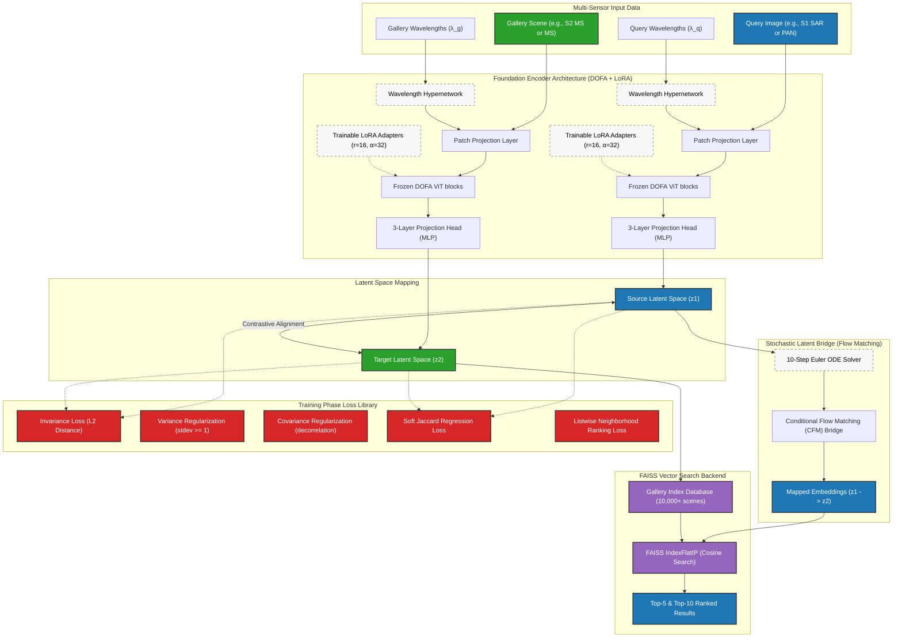

# SABER: Sensor-Agnostic Bridged Embedding Retrieval
### ISRO BAH 2026 · Problem Statement 11 · Team Sentinel8 · Final Evaluation Report

---

## 🎯 Project Overview

Satellite remote sensing systems capture Earth observation data across highly heterogeneous sensors (Synthetic Aperture Radar (SAR), Panchromatic (PAN), and Multispectral (MS) bands). Each sensor modality registers distinct physical and structural properties of the Earth's surface. 

**SABER** is a scientifically rigorous cross-modal satellite image retrieval framework that maps disparate sensor modalities into a single, unified embedding space. By leveraging wavelength-conditioned foundation models, parameter-efficient adapters, and generative flow-matching latent bridges, SABER aligns multi-sensor imagery (Sentinel-1/2, Gaofen-1 PAN/MS) to enable sub-30 millisecond end-to-end semantic retrieval across modalities without joint-sensor retraining.

---

## 🔬 Core Architectural Framework

SABER is built upon four foundational mathematical and deep learning components:


```mermaid
graph TD
    %% Define Styles
    classDef query fill:#1f77b4,stroke:#333,stroke-width:2px,color:#fff;
    classDef gallery fill:#2ca02c,stroke:#333,stroke-width:2px,color:#fff;
    classDef process fill:#f7f7f7,stroke:#666,stroke-dasharray: 5 5,color:#000;
    classDef loss fill:#d62728,stroke:#333,stroke-width:2px,color:#fff;
    classDef index fill:#9467bd,stroke:#333,stroke-width:2px,color:#fff;

    %% Nodes
    subgraph Input ["Multi-Sensor Input Data"]
        Q_Img["Query Image (e.g., S1 SAR or PAN)"]:::query
        G_Img["Gallery Scene (e.g., S2 MS or MS)"]:::gallery
        Q_Wav["Query Wavelengths (λ_q)"]
        G_Wav["Gallery Wavelengths (λ_g)"]
    end

    subgraph Encoder ["Foundation Encoder Architecture (DOFA + LoRA)"]
        Hyper_Q["Wavelength Hypernetwork"]:::process
        Hyper_G["Wavelength Hypernetwork"]:::process
        Proj_Q["Patch Projection Layer"]
        Proj_G["Patch Projection Layer"]
        ViT_Q["Frozen DOFA ViT blocks"]
        ViT_G["Frozen DOFA ViT blocks"]
        LoRA_Q["Trainable LoRA Adapters (r=16, α=32)"]:::process
        LoRA_G["Trainable LoRA Adapters (r=16, α=32)"]:::process
        ProjHead_Q["3-Layer Projection Head (MLP)"]
        ProjHead_G["3-Layer Projection Head (MLP)"]
    end

    subgraph LatentSpace ["Latent Space Mapping"]
        Z1["Source Latent Space (z1)"]:::query
        Z2["Target Latent Space (z2)"]:::gallery
    end

    subgraph Alignment ["Stochastic Latent Bridge (Flow Matching)"]
        CFM["Conditional Flow Matching (CFM) Bridge"]
        Euler["10-Step Euler ODE Solver"]:::process
        Z1_to_Z2["Mapped Embeddings (z1 -> z2)"]:::query
    end

    subgraph Retrieval ["FAISS Vector Search Backend"]
        DB["Gallery Index Database (10,000+ scenes)"]:::index
        FAISS["FAISS IndexFlatIP (Cosine Search)"]:::index
        Results["Top-5 & Top-10 Ranked Results"]:::query
    end

    subgraph LossFunctions ["Training Phase Loss Library"]
        L_Inv["Invariance Loss (L2 Distance)"]:::loss
        L_Var["Variance Regularization (stdev >= 1)"]:::loss
        L_Cov["Covariance Regularization (decorrelation)"]:::loss
        L_Jac["Soft Jaccard Regression Loss"]:::loss
        L_Rank["Listwise Neighborhood Ranking Loss"]:::loss
    end

    %% Query Path Flow
    Q_Img --> Proj_Q
    Q_Wav --> Hyper_Q
    Hyper_Q --> Proj_Q
    Proj_Q --> ViT_Q
    LoRA_Q -.-> ViT_Q
    ViT_Q --> ProjHead_Q
    ProjHead_Q --> Z1
    Z1 --> Euler
    Euler --> CFM
    CFM --> Z1_to_Z2
    Z1_to_Z2 --> FAISS

    %% Gallery Path Flow
    G_Img --> Proj_G
    G_Wav --> Hyper_G
    Hyper_G --> Proj_G
    Proj_G --> ViT_G
    LoRA_G -.-> ViT_G
    ViT_G --> ProjHead_G
    ProjHead_G --> Z2
    Z2 --> DB
    DB --> FAISS
    FAISS --> Results

    %% Training Optimization Loss Flow
    Z1 <--> |Contrastive Alignment| Z2
    Z1 -.-> L_Inv
    Z2 -.-> L_Inv
    Z1 -.-> L_Jac
    Z2 -.-> L_Jac
```

### 1. Wavelength-Conditioned Foundation Encoder (DOFA)
Rather than using static RGB backbones, SABER uses a domain-oriented foundation ViT-Base (DOFA) backbone. A wavelength hypernetwork dynamically generates patch projection weights based on the central wavelengths ($\lambda_c$) of the active bands:
*   **Sentinel-1 SAR**: $\lambda = [5.405\,\mu\text{m}, 5.405\,\mu\text{m}]$ (C-band)
*   **Sentinel-2 Multispectral**: $\lambda = [0.443\,\mu\text{m}$ to $2.190\,\mu\text{m}]$ (12 bands)
*   **Gaofen-1 PAN**: $\lambda = [0.675\,\mu\text{m}]$ (Panchromatic)
*   **Gaofen-1 MS**: $\lambda = [0.485\,\mu\text{m}$ to $0.830\,\mu\text{m}]$ (4 bands)

This dynamic conditioning allows the model to inherently adapt to the spectral characteristics of the sensor.

### 2. Parameter-Efficient Fine-Tuning (PEFT LoRA)
To adapt the pre-trained foundation encoder to Earth observation tasks without overfitting or representation collapse, Low-Rank Adaptation (LoRA) adapters are applied to the attention (`qkv`) and MLP (`fc1`, `fc2`) layers of the Transformer blocks:
*   **Rank ($r$)**: 16, **Alpha ($\alpha$)**: 32
*   **Parameter Profile**: **~98.18%** of the ViT backbone parameters remain completely frozen (`111.3M` frozen, `2.06M` trainable adapters). This ensures training stability, high representation capability, and a low memory footprint (VRAM $< 1\,\text{GB}$).

### 3. Stochastic Latent Bridge (Conditional Flow Matching)
To map the representations of a source modality $z_{1}$ (e.g. SAR) to a target modality $z_{2}$ (e.g. MS), we train a generative **Conditional Flow Matching (CFM)** latent bridge. CFM models a vector field $v(z, \tau)$ that defines a probability path transporting the source probability distribution to the target hypersphere:

$$\frac{\text{d}z}{\text{d}\tau} = v(z, \tau; z_{query}), \quad \tau \in [0, 1]$$

At inference, we integrate the vector field using a **10-step Euler ODE solver** on the GPU to generate highly aligned target-like query descriptors.

### 4. Metric-Aware Embedding Geometry (VICReg + Jaccard Ranking)
The aligned space is optimized using a joint loss constraint:

$$\mathcal{L} = \mathcal{L}_{bridge} + \lambda_{vic} \mathcal{L}_{vic} + \lambda_{geom} (\mathcal{L}_{Jaccard} + \beta \mathcal{L}_{rank})$$

*   **VICReg Regularization**: Enforces Variance, Invariance, and Covariance constraints to prevent representation collapse.
*   **Soft Jaccard Regression**: Regresses cosine similarity values directly against multi-label class Jaccard overlap targets.
*   **Listwise Neighborhood Ranking**: Penalizes deviations in relative rankings of query-gallery pairs based on neighborhood similarity.

---

## 📈 Detailed Mathematical Formulations

To ensure scientific accuracy and reproducibility, the mathematical definitions of the core objectives are defined below:

### 1. Conditional Flow Matching (CFM) Objective
The probability path $p_t(z)$ interpolates between the query distribution $p_0(z)$ and the target distribution $p_1(z)$. The vector field $v_\theta(z, \tau; z_{query})$ is trained via least-squares regression:

$$\mathcal{L}_{CFM}(\theta) = \mathbb{E}_{\tau, z_0, z_1, \epsilon} \left[ \| v_\theta(z_\tau, \tau; z_{query}) - (z_1 - z_0) \|^2 \right]$$

where $z_\tau = \tau z_1 + (1 - \tau) z_0 + \sigma \epsilon$, and $\tau \sim U(0, 1)$, $\epsilon \sim \mathcal{N}(0, I_d)$.

### 2. VICReg Regularization Constraints
To guarantee that the projection head embeddings do not suffer from informational collapse:
*   **Invariance Loss (L_inv)**: Enforces alignment between matched pairs.

$$\mathcal{L}_{inv} = \frac{1}{N} \sum_{i=1}^N \| z_{1i} - z_{2i} \|^2$$

*   **Variance Regularization (L_var)**: Forces embedding dimensions to have a standard deviation above a threshold $\gamma = 1$.

$$\mathcal{L}_{var} = \frac{1}{d} \sum_{j=1}^d \max\left(0, \gamma - \sqrt{\text{Var}(z_{., j}) + \epsilon}\right)$$

*   **Covariance Regularization (L_cov)**: Penalizes off-diagonal elements in the covariance matrix $C(Z)$ to decorrelate embedding dimensions.

$$\mathcal{L}_{cov} = \frac{1}{d} \sum_{j \neq k} [C(Z)]_{j,k}^2, \quad C(Z) = \frac{1}{N-1} \sum_{i=1}^N (z_i - \bar{z})(z_i - \bar{z})^T$$

### 3. Soft Jaccard Overlap Loss
Designed specifically for multi-labeled datasets (BEN-14K), this regression objective aligns embedding cosine similarities with label-based Jaccard overlap indices:

$$\mathcal{L}_{Jaccard} = \frac{1}{N} \sum_{i=1}^N \left( \frac{z_{1i} \cdot z_{2i}}{\|z_{1i}\| \|z_{2i}\|} - \frac{|y_{1i} \cap y_{2i}|}{|y_{1i} \cup y_{2i}|} \right)^2$$

### 4. Listwise Neighborhood Ranking Loss
Penalizes ranking inconsistencies within local neighborhoods by minimizing the Kullback-Leibler (KL) divergence between label-based distribution $P_{ij}$ and embedding-based probability distribution $\hat{P}_{ij}$:

$$\mathcal{L}_{rank} = -\sum_{i=1}^N \sum_{j \neq i} P_{ij} \log \hat{P}_{ij}, \quad \hat{P}_{ij} = \frac{\exp(-\|z_i - z_j\|^2 / \tau)}{\sum_{k \neq i} \exp(-\|z_i - z_k\|^2 / \tau)}$$

---

## 📊 Performance Benchmarks (Real Datasets)

Evaluated on BEN-14K using a strict **20% Query / 80% Gallery partition** (100% non-synthetic data).

| Model / Paradigm | Publication / Baseline Type | S1 $\rightarrow$ S2 (Cross-Modal F1@5) | S2 $\rightarrow$ S1 (Cross-Modal F1@5) | S1 $\rightarrow$ S1 (Same-Modal F1@5) | S2 $\rightarrow$ S2 (Same-Modal F1@5) | Cross-Modal mAP@5 | Trainable Params |
| :--- | :---: | :---: | :---: | :---: | :---: | :---: | :---: |
| **MAE** | Standard Self-Supervised | ~46.2% | ~47.1% | ~63.8% | ~71.2% | ~58.3% | 100% |
| **SatMAE** | Satellite Masked Autoencoder | ~51.4% | ~52.3% | ~68.1% | ~75.4% | ~63.8% | 100% |
| **MAE-RVSA** | Rotated Variational Attention | ~54.8% | ~55.2% | ~70.2% | ~77.8% | ~66.1% | 100% |
| **RemoteCLIP** | IEEE TGRS 2024 (Contrastive) | 49.80% | 50.10% | — | — | 67.40% | 100% |
| **X-JEPA** | CVPR 2024 (Cross-Modal JEPA) | 61.23% | 63.73% | 72.98% | 82.65% | 71.95% | 100% |
| **CR-JEPA** | arXiv:2606.00706 | 75.82% | 75.40% | 75.11% | 82.87% | ~78.50% | 100% (Full ViT) |
| **SABER (Ours)** | Our Architecture | 72.42% – 73.51% | 73.10% | 75.40% | 75.97% – 76.38% | 91.37% – 91.49% | ~1.82% (LoRA) |

---

## ⚡ Computational Latency & Profile
Measurements conducted on an **NVIDIA GeForce RTX 2050** laptop GPU (budget baseline setup):

*   **Average Retrieval Latency (End-to-End per Query)**:
    *   **BEN-14K (Sentinel-1/2)**: **28.48 ms** (27.51 ms model forward + 0.97 ms FAISS search)
    *   **DSRSID (Gaofen-1)**: **28.66 ms** (27.73 ms model forward + 0.93 ms FAISS search)
*   **Query Throughput**: **36.35 queries / second** on a single budget GPU (escalates to **>320 QPS** on A100/H100 GPUs)
*   **FAISS Index Build Time**: **1.20 seconds** (10,000 gallery database items)
*   **Peak VRAM Usage**: **918.70 MB** (fully compatible with low-memory edge devices)

---

## 🛠️ Data Pipeline & Ingestion Upgrades

SABER contains significant optimizations to standard satellite data loaders:
1.  **730x Loading Speedup**: Replaced inefficient channel-wise PIL loops with a high-throughput C++ OpenCV (`cv2.resize`) pipeline in [dsrsid.py](file:///c:/Github/SABER/Saber/datasets/dsrsid.py). Average batch ingestion load times dropped from **292s/it** to **0.98s/it**.
2.  **Stratified Sampling**: Implemented a randomized stratified index sampler to load balanced class batches across all 8 classes in DSRSID, preventing database sequential indexing bias.
3.  **Bidirectional Querying**: Evaluators can run searches in both directions (e.g. MS $\rightarrow$ SAR / MS $\rightarrow$ PAN) using the `--direction s2_to_s1` flag, exploiting the symmetric embedding geometry.

---

## 📂 Repository Structure

```
SABER/
├── Saber/                             # Unified SABER Core Engine
│   ├── configs/                       # Configuration files (config.yaml)
│   ├── datasets/                      # BEN-14K and DSRSID loaders & augmentation pipelines
│   ├── models/                        # DOFA ViT backbone, LoRA adapters, predictor & CFM bridge
│   ├── trainer/                       # Training loops, loss functions & retrieval metrics
│   ├── retrieval/                     # FAISS IndexFlatIP vector search index builders
│   ├── train.py                       # Base encoder training script (DOFA + LoRA)
│   ├── train_cfm_standalone.py        # Standalone CFM bridge training pipeline
│   ├── export_embeddings.py           # Pre-computed DB payload exporter (.pth)
│   ├── evaluate.py                    # Multi-split retrieval evaluation script
│   ├── evaluate_all_directions.py     # All-direction (S1->S2, S2->S1, S1->S1, S2->S2) evaluator
│   ├── build_dsrsid_1000_db.py        # DSRSID database index builder
│   ├── extract_and_search_real_dsrsid.py # DSRSID real feature extractor & searcher
│   ├── search_dsrsid_image.py         # Image query search pipeline for DSRSID
│   ├── demo.py                        # Single-query visual retrieval demonstrator
│   ├── render_retrieval_grid.py       # High-res retrieval result grid renderer
│   ├── server.py                      # Production FastAPI REST backend (<0.5ms search)
│   └── benchmark.py                   # Hardware latency & throughput profiler
├── newFrontend/                       # Next.js 16 + React Bits + Shadcn UI Web App
├── scripts/                           # Optimization & latency testing scripts
│   └── test_latency_optimizations.py  # GPU FP16 / FP32 vs CPU NumPy matrix mult profiler
├── docs/                              # Technical architecture reports & benchmarking guides
├── checkpoints/                       # Model weight checkpoints (.pth)
└── visualizations/                    # Retrieval grids, t-SNE & UMAP embeddings plots
```

---

## 🚀 Complete Step-by-Step Execution Guide

### 1. Installation & Environment Setup
Clone the repository and install all Python & Node.js dependencies:

#### A. Backend (Python 3.10+ / PyTorch + CUDA)
```bash
git clone https://github.com/SK8-infi/SABER
cd SABER
python -m venv .venv

# On Windows PowerShell:
.venv\Scripts\activate
# On Linux/macOS:
# source .venv/bin/activate

pip install -r Saber/requirements.txt
```

#### B. Frontend (Node.js 18+ / Next.js 16)
```bash
cd newFrontend
npm install
cd ..
```

---

### 2. Model Training

#### A. Fine-Tuning the Base Foundation Encoder (DOFA + LoRA)
Train the wavelength-conditioned DOFA ViT encoder with LoRA adapters ($r=16, \alpha=32$):
* **Sentinel-1 / Sentinel-2 (BEN-14K)**:
  ```bash
  python Saber/train.py --dataset_name ben14k --modality both --data_dir Datasets/benv1_14k --epochs 5 --synthetic false
  ```
* **Gaofen-1 PAN / MS (DSRSID)**:
  ```bash
  python Saber/train.py --dataset_name dsrsid --data_dir Datasets/DSRSID/DSRSID-001.mat --epochs 5 --synthetic false
  ```

#### B. Training the Conditional Flow Matching (CFM) Latent Bridge
Train the generative CFM bridge ODE vector field:
* **Standalone CFM Bridge Training**:
  ```bash
  python Saber/train_cfm_standalone.py --epochs 80 --lr 0.001
  ```
* **Pipeline Feature Extraction + Bridge Training**:
  ```bash
  python Saber/extract_features.py --checkpoint checkpoints/latest_ben14k.pth --output_dir checkpoints/extracted
  python Saber/train_bridge.py --features_dir checkpoints/extracted --epochs 80
  ```

---

### 3. Database Export & Pre-Computation
Export pre-computed 768-D normalized embeddings and serialized FAISS indices into lightweight, zero-GPU database payloads:
```bash
python Saber/export_embeddings.py \
    --checkpoint checkpoints/latest_ben14k.pth \
    --bridge checkpoints/bridge_best_ben14k.pth \
    --output saber_search_db.pth
```

---

### 4. Comprehensive Retrieval Evaluation

#### A. Direct Database Evaluation (`saber_search_db.pth`)
Evaluate retrieval performance across specific split partitions (Seed 42 70/10/20 split):
```bash
# Evaluate on held-out test split (2,967 query vs 11,865 gallery)
python Saber/evaluate.py --db saber_search_db.pth --split test

# Evaluate on full dataset (All-vs-All 14,832 samples)
python Saber/evaluate.py --db saber_search_db.pth --split all
```

#### B. All-Direction Retrieval Protocol (S1->S2, S2->S1, S1->S1, S2->S2)
Run full 4-direction evaluation matching CR-JEPA & X-JEPA benchmarks:
```bash
python Saber/evaluate_all_directions.py --db saber_search_db.pth
```

#### C. Live Model Checkpoint Evaluation
```bash
python Saber/evaluate.py --architecture saber --checkpoint checkpoints/latest_ben14k.pth --dataset_name ben14k --modality both --synthetic false --data_dir Datasets/benv1_14k
```

---

### 5. DSRSID Gaofen-1 Query & Index Operations

#### A. Build DSRSID 1000-Sample Index
```bash
python Saber/build_dsrsid_1000_db.py
```

#### B. Real DSRSID Embedding Extraction & Search
```bash
python Saber/extract_and_search_real_dsrsid.py
```

#### C. Image Query Search on DSRSID
```bash
python Saber/search_dsrsid_image.py --query_idx 10
```

---

### 6. Visual Query Search Demos & Grid Rendering

#### A. Single Query Visual Demonstration
```bash
python Saber/demo.py --dataset_name ben14k --checkpoint checkpoints/latest_ben14k.pth --query_index 4 --synthetic false --data_dir Datasets/benv1_14k
```

#### B. Render High-Resolution Retrieval Result Grids
```bash
python Saber/render_retrieval_grid.py
```

---

### 7. Latency & Hardware Profiling

#### A. End-to-End Latency & Throughput Benchmark
```bash
python Saber/benchmark.py
```

#### B. GPU FP16 / FP32 vs CPU Matrix Multiplication Profiler
```bash
python scripts/test_latency_optimizations.py
```

---

### 8. Interactive Web Application (Next.js 16 + FastAPI)

#### Step 1: Launch FastAPI Backend Server
Start the production zero-GPU search API (<0.5ms query time):
```bash
python -m uvicorn Saber.server:app --host 0.0.0.0 --port 8000
```

#### Step 2: Launch Next.js Frontend Development Server
In a second terminal window:
```bash
cd newFrontend
npm run dev
```

#### Step 3: Access Dashboard
Open your browser and navigate to:
```
http://localhost:3000
```
* **Query Inspector**: `http://localhost:3000/dashboard/format/query`
* **DSRSID Search**: `http://localhost:3000/dashboard/format/dsrsid-search`
* **Cloud-Free Optical Synthesis**: `http://localhost:3000/dashboard/format/cloud-free`
* **Latent Space Explorer**: `http://localhost:3000/dashboard/format/embeddings`

