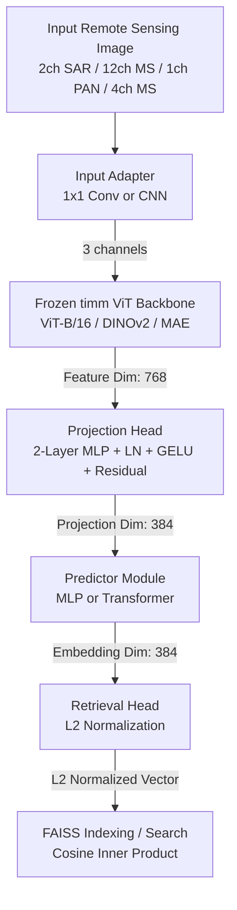
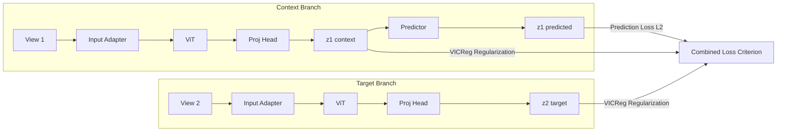

# Remote Sensing Image Retrieval System (REJEPA Baseline)

A modular, production-ready Remote Sensing Image Retrieval system based on the **Joint Embedding Predictive Architecture (JEPA)** paradigm. This project was developed as a hackathon prototype, designed to be fully customizable, extensible, and optimized for future research integrations (specifically preparing for the transition from the REJEPA baseline to the future SABER model architecture).

---

## Architecture Diagram

The diagram below represents the modular execution flow of the system. Every block is configurable via `config.yaml` and decouples feature extraction, projection, and metric retrieval.



### Module Flow & Predictive Loss (Training Phase)

During the training phase, the model operates on dual augmented views of the same image (context view $x_1$ and target view $x_2$) in a self-supervised joint embedding manner:



---

## Directory Structure

```
Saber/
  configs/
    config.yaml            # Configurable hyperparameters and settings
  datasets/
    base_dataset.py        # Abstract base dataset with synthetic fallback
    ben14k.py              # BEN-14K (Sentinel-1/2) loader
    dsrsid.py              # DSRSID (PAN/MS) loader
    transforms.py          # Albumentations augmentations
  models/
    backbone.py            # timm ViT loader & freezing logic
    input_adapter.py       # Maps arbitrary bands to 3 channels
    projection_head.py     # 2-Layer MLP projecting ViT outputs
    predictor.py           # MLP or Transformer context-to-target predictor
    vicreg.py              # VICReg projection head wrapper
    Saber.py              # Core model combining all modules
    retrieval_head.py      # Normalizes embeddings for FAISS matching
  losses/
    prediction_loss.py     # L2 prediction target loss
    vicreg_loss.py         # Variance-Invariance-Covariance loss
    combined_loss.py       # Weighted composite training loss
  trainer/
    trainer.py             # PyTorch training coordinator (AMP, GradClip)
    evaluator.py           # Partitions query/gallery & extracts embeddings
    metrics.py             # Computes Precision@5, Recall@5, F1@5, mAP
  retrieval/
    faiss_index.py         # FAISS Flat index builder and searcher
    retriever.py           # Translates FAISS index hits to filenames/labels
  visualization/
    tsne.py                # t-SNE plotter
    umap.py                # UMAP plotter (with PCA fallback)
    attention.py           # ViT attention overlay heatmap extractor
    similarity.py          # Similarity matrix heatmap & Retrieval grid generator
  train.py                 # Training script entry point
  evaluate.py              # Index building & evaluation script entry point
  demo.py                  # Single query search and grid visualization script
  requirements.txt         # Project requirements
  README.md                # System documentation
```

---

## Setup Instructions

### 1. Prerequisites & Virtual Environment

Set up a Python 3.10+ virtual environment in the project directory:

```bash
# Navigate to the workspace root
cd SABER

# Create a virtual environment
python -m venv Saber/.venv

# Activate the virtual environment
# Windows (PowerShell):
.\Saber\.venv\Scripts\Activate.ps1
# Linux/macOS:
source Saber/.venv/bin/activate
```

### 2. Dependency Installation

Install the required packages list:

```bash
python -m pip install --upgrade pip
python -m pip install -r Saber/requirements.txt
```

---

## How to Run the Pipeline (Quick Start & Evaluation)

### A. Phase 1: Synthetic Data Fast-Verification

To verify that the model architecture, dataloaders, composite losses, FAISS indexing, evaluation splits, and visualization tools are fully operational without waiting for large datasets to download, you can execute the pipeline in **synthetic mode**:

1. **Train for 2 epochs on synthetic data**:
   ```bash
   python Saber/train.py --epochs 2 --synthetic true
   ```
   *This saves checkpoints to `Saber/checkpoints/` and logs TensorBoard telemetry to `Saber/logs/`.*

2. **Evaluate & Build the FAISS index**:
   ```bash
   python Saber/evaluate.py --checkpoint Saber/checkpoints/latest.pth --synthetic true
   ```
   *This builds the FAISS index database in `Saber/checkpoints/faiss_index.bin`, logs evaluation metrics (Precision@5, Recall@5, mAP), and saves visual plots (`tsne.png`, `umap.png`, `similarity_heatmap.png`) to `Saber/visualizations/`.*

3. **Perform a Query Retrieval Search**:
   ```bash
   python Saber/demo.py --checkpoint Saber/checkpoints/latest.pth --query_index 4 --synthetic true
   ```
   *This retrieves the top 5 matches, logs class labels and similarities, and writes the `retrieval_results.png` grid and the ViT `query_attention.png` attention overlay to the visualizations folder.*

---

### B. Phase 2: Running on Real Datasets

You can configure dataset settings directly inside `Saber/configs/config.yaml` or use **CLI overrides** at runtime to avoid editing config files on disk.

### CLI Overrides
Both `train.py` and `evaluate.py` support the following parameters to override `config.yaml` on the fly:
* `--dataset_name`: Set the active dataset (`ben14k` or `dsrsid`).
* `--data_dir`: Provide the path to the dataset directory (e.g., path to HDF5 `.mat` file or folder).
* `--modality`: Select the input modalities (`s1` for SAR, `s2` for Optical, or `both` for Cross-Modal bimodal data).
* `--epochs`: Override training epoch count.
* `--batch_size`: Override batch size.
* `--synthetic`: Force synthetic mode (`true` or `false`).

### Examples

1. **Train on Sentinel-1 SAR modality for BEN-14K**:
   ```bash
   python Saber/train.py --dataset_name ben14k --modality s1 --data_dir c:/Github/SABER/Datasets/benv1_14k --epochs 5 --synthetic false
   ```

2. **Evaluate Cross-Modal retrieval (SAR ◄► Optical)**:
   ```bash
   python Saber/evaluate.py --checkpoint checkpoints/latest.pth --dataset_name ben14k --modality both --data_dir c:/Github/SABER/Datasets/benv1_14k --synthetic false
   ```

3. **Train on DSRSID (Gaofen-1) dataset**:
   ```bash
   python Saber/train.py --dataset_name dsrsid --data_dir c:/Github/SABER/Datasets/DSRSID/DSRSID-001.mat --epochs 5 --synthetic false
   ```

---

## Extensibility (Transitioning from REJEPA to SABER)

One of the primary goals of this architecture is **future-proofing**. When the time comes to evaluate the new SABER architecture, **no changes** will be needed in the datasets, trainers, evaluators, retrievers, or visualization layers.

The replacement process is abstracted to a single module boundary:
1. Create your new model implementation inside `Saber/models/saber.py` exposing a class `SABER` matching the standard PyTorch `nn.Module` signature.
2. The model must implement:
   - `__init__(self, config, in_channels)`: To load parameters.
   - `forward(self, x1, x2=None)`: Returning projections/predictions.
   - `get_retrieval_embedding(self, x)`: Returning an L2-normalized embedding tensor.
3. Update `config.yaml` or swap the import inside `train.py`, `evaluate.py`, and `demo.py` from `from Saber.models.rejepa import REJEPA` to `from Saber.models.saber import SABER`.
