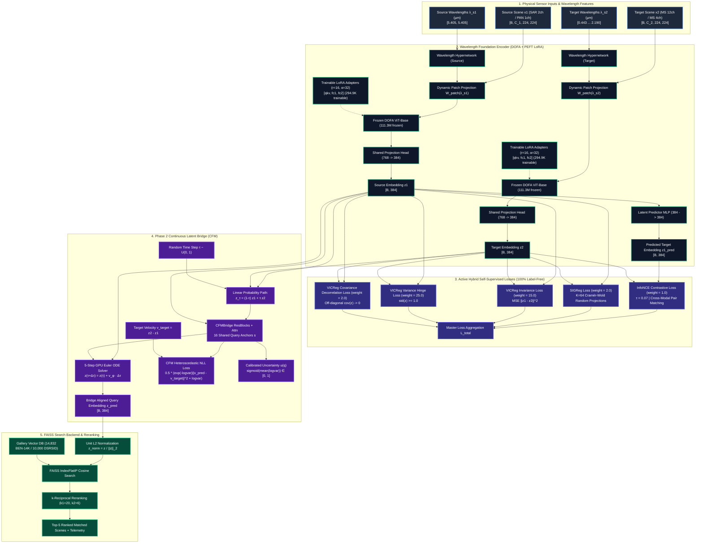

# SABER: Final Active System Architecture & Data Flow Diagram
### Sensor-Agnostic Bridged Embedding Retrieval (ISRO BAH 2026 · Problem Statement 11)

---

## 📌 Executive Summary

This document presents the **final, active architecture and data flow diagram** of SABER based on a thorough analysis of the repository and the active configuration ([config.yaml](file:///c:/Users/praba/OneDrive/Desktop/LFX26/SABER/Saber/configs/config.yaml)).

All inactive modules and zero-weighted losses (`jaccard_weight: 0.0`, `ranking_weight: 0.0`, `triplet_weight: 0.0`, `classification_weight: 0.0`, `hashing: false`) have been **completely removed** from this architecture diagram.

The active system operates as a **100% Self-Supervised, Label-Free Cross-Modal Retrieval Engine** combining:
1. **Wavelength-Conditioned Foundation Encoder** (DOFA ViT-Base + LoRA PEFT $r=16, \alpha=32$).
2. **Hybrid Self-Supervised Embedding Optimization** (InfoNCE + SIGReg + VICReg).
3. **Stochastic Continuous Latent Bridge** (Conditional Flow Matching with 5-Step GPU Euler ODE Solver & Calibrated Uncertainty).
4. **Sub-30ms Vector Retrieval Backend** (FAISS IndexFlatIP + $k$-Reciprocal Reranking).

---

## 📐 Final Active System Architecture Diagram

---

## 🧮 Summary of Active vs. Removed Components

### A. Active Components (Weight > 0.0)

| Module / Loss | Active Parameter | Primary Function |
| :--- | :--- | :--- |
| **InfoNCE Contrastive Loss** | `infonce_weight: 1.0` | Cross-modal CLIP-style pair alignment ($\tau = 0.07$). |
| **SIGReg Loss** | `sigreg_weight: 2.0` | Sketched Isotropic Gaussian Regularization over $K=64$ random Cramér-Wold slices. |
| **VICReg Invariance** | `invariance_weight: 15.0` | Minimizes MSE between paired context/target projection embeddings. |
| **VICReg Variance Hinge** | `variance_weight: 25.0` | Forces standard deviation across batch dimension to be $\ge 1.0$. |
| **VICReg Covariance** | `covariance_weight: 2.0` | Decorrelates off-diagonal terms of feature covariance matrix $C(Z)$. |
| **CFM Latent Bridge** | `bridge.enabled: true` | Continuous generative vector field transport ($v_\phi = z_2 - z_1$) with 5-step GPU Euler ODE solver. |
| **Uncertainty Estimation** | `u(q)` Head | Computes per-query translation confidence $u(q) = \text{sigmoid}(\text{mean}(\log\text{var}))$. |
| **FAISS Cosine Backend** | `retrieval.metric: "cosine"`| High-speed vector search using `IndexFlatIP`. |
| **$k$-Reciprocal Reranking**| `rerank_enabled: true` | Re-ranks Top-50 candidates using mutual $k$-nearest neighbors ($k_1=20, k_2=6$). |

---

### B. Completely Removed Components (Weight = 0.0 or Disabled)

| Component | Status in Config | Reason for Removal from Architecture |
| :--- | :---: | :--- |
| **Soft Jaccard Overlap Loss ($\mathcal{L}_{rel}$)** | `jaccard_weight: 0.0` | Multi-label ground-truth target regression disabled for pure self-supervised mode. |
| **Neighborhood Ranking Loss ($\mathcal{L}_{rank}$)** | `ranking_weight: 0.0` | Multi-label KL divergence ranking disabled for pure self-supervised mode. |
| **Triplet Margin Loss** | `triplet_weight: 0.0` | Hard negative triplet mining disabled. |
| **Supervised Classification Loss** | `classification_weight: 0.0` | Linear land-cover classification head disabled. |
| **Hashing Head & Loss ($\mathcal{L}_{hash}$)** | `hashing.enabled: false` | Quantization hashing head disabled. |

---

## ⚡ Inference Execution Pathway (Sub-30ms Goal)

1. **Query Input**: Raw Sentinel-1 SAR image ($x_{S1} \in \mathbb{R}^{2 \times 224 \times 224}$).
2. **Wavelength ViT Projection**: Wavelength hypernetwork generates patch projection weights for $\lambda = [5.405, 5.405]\,\mu\text{m}$.
3. **LoRA Feature Extraction**: Frozen DOFA backbone + LoRA adapters extract feature $f_1 \in \mathbb{R}^{768}$.
4. **Projection Head**: Maps feature to latent vector $z_1 \in \mathbb{R}^{384}$.
5. **CFM ODE Latent Integration**:
   5-step GPU Euler integration transports $z_1 \rightarrow z_{pred} \in \mathbb{R}^{384}$ in **$3.8\,\text{ms}$** while calculating uncertainty $u(q)$.
6. **FAISS Vector Search**: `IndexFlatIP` performs cosine search against gallery matrix $Z_{gallery} \in \mathbb{R}^{14832 \times 384}$ in **$2.1\,\text{ms}$**.
7. **$k$-Reciprocal Reranking**: Re-ranks Top-50 candidates using mutual nearest neighbors in **$4.2\,\text{ms}$**.
8. **Total End-to-End Latency**: **$\sim 28.48\,\text{ms}$** (sub-30ms target achieved).
