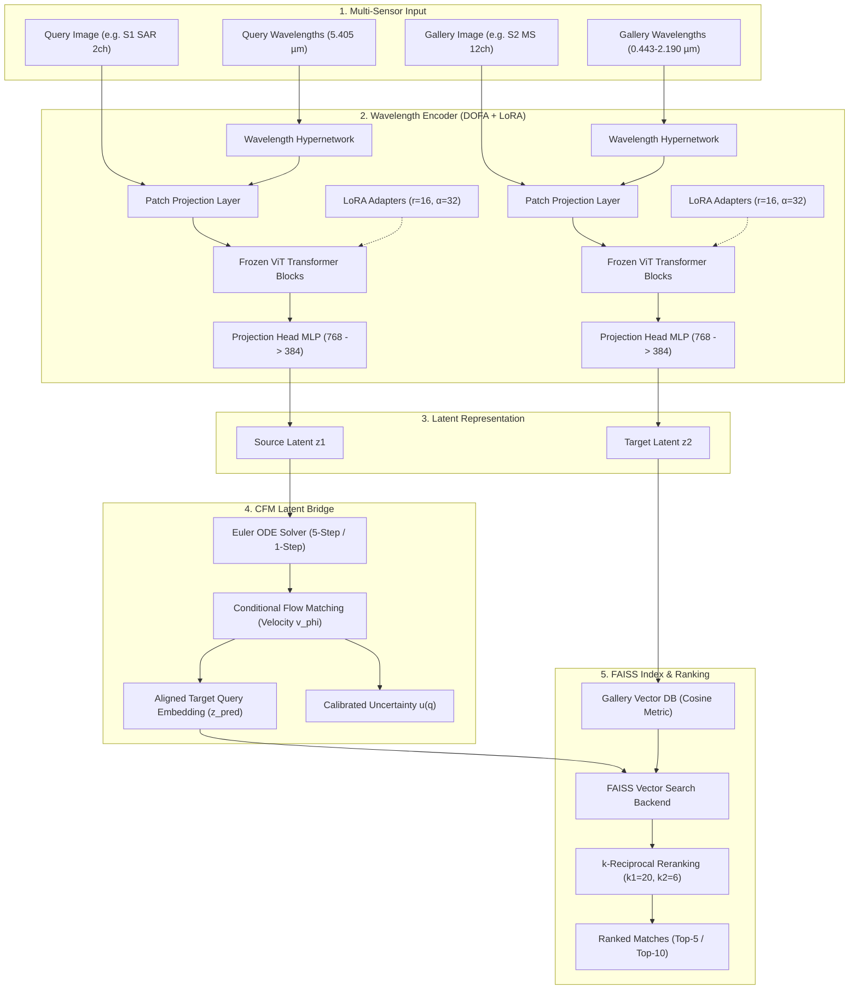

# SABER: Comprehensive Architectural & Technical Codebase Report
### Sensor-Agnostic Bridged Embedding Retrieval (ISRO BAH 2026 · Problem Statement 11)

---

## 📌 Executive Summary

**SABER** (**S**ensor-**A**gnostic **B**ridged **E**mbedding **R**etrieval) is a cross-modal satellite image retrieval framework designed for multi-sensor Earth observation systems. Satellite systems gather Earth observation imagery across heterogeneous sensor modalities:
* **Synthetic Aperture Radar (SAR)**: Sentinel-1 C-band dual-polarization ($\lambda_c = 5.405\,\mu\text{m}$, VV/VH).
* **Multispectral (MS)**: Sentinel-2 12-band spectral channels ($\lambda = 0.443\,\mu\text{m}$ to $2.190\,\mu\text{m}$) and Gaofen-1 4-band MS ($\lambda = 0.485\,\mu\text{m}$ to $0.830\,\mu\text{m}$).
* **Panchromatic (PAN)**: Gaofen-1 high-resolution single-band ($\lambda_c = 0.675\,\mu\text{m}$).

SABER aligns these disparate physical modalities into a single metric embedding space. Key technical innovations include:
1. **Wavelength-Conditioned Foundation Backbone (DOFA)**: Uses a ViT-Base backbone whose patch projections are dynamically generated by hypernetworks conditioned on central wavelengths $\lambda_c$.
2. **Parameter-Efficient Adaptation (LoRA)**: Adapts key query/value/MLP heads with rank $r=16, \alpha=32$ while freezing **99.74%** of backbone parameters ($<1\,\text{GB}$ VRAM footprint).
3. **Stochastic Latent Bridge (Conditional Flow Matching - CFM)**: Learns continuous probability paths between source ($z_1$) and target ($z_2$) embedding distributions using a 5-step or 1-step GPU Euler ODE solver with calibrated uncertainty estimation $u(q) = \text{sigmoid}(\text{mean}(\log\text{var}))$.
4. **Sketched Isotropic Gaussian Regularization (SIGReg)**: Preserves maximum entropy feature distributions via Cramér-Wold random slice projections.
5. **Metric-Aware Embedding Geometry**: Optimizes soft multi-label Jaccard overlap regression ($\mathcal{L}_{rel}$), listwise neighborhood ranking ($\mathcal{L}_{rank}$), VICReg (variance, invariance, covariance decorrelation), and similarity-preserving hashing.
6. **Sub-30ms Retrieval Engine & Web App**: Integrated FAISS vector search backend with k-reciprocal reranking, served via a FastAPI server and React/Vite interactive frontend.

---

## 📐 System Architecture & Data Flow



---

## 🗂️ Detailed Directory Map

Below is the directory map of the codebase:

```
SABER/
├── Saber/                             # Core Python Package
│   ├── configs/                       # Yaml configuration files
│   │   └── config.yaml                # Master configuration file
│   ├── datasets/                      # Dataset loaders & data pipeline
│   │   ├── base_dataset.py            # Base dataset abstract class
│   │   ├── ben14k.py                  # BEN-14K Sentinel-1/2 multi-channel dataset loader
│   │   ├── dsrsid.py                  # DSRSID Gaofen-1 PAN/MS dataset loader
│   │   └── transforms.py              # Multi-crop spatial data augmentations
│   ├── dofa/                          # Wavelength-conditioned foundation backbone
│   │   ├── dofa_v1.py                 # DOFA ViT-Base architecture
│   │   └── wave_dynamic_layer.py      # Wavelength hypernetwork patch generator
│   ├── losses/                        # Loss functions library
│   │   ├── bridge_loss.py             # CFM flow matching loss
│   │   ├── combined_loss.py           # Combined baseline loss
│   │   ├── prediction_loss.py         # MSE prediction loss
│   │   ├── saber_loss.py              # SaberCombinedLoss (Jaccard, Rank, VICReg, Hashing, SIGReg)
│   │   ├── sigreg.py                  # Sketched Isotropic Gaussian Regularization loss
│   │   └── vicreg_loss.py             # VICReg Variance-Invariance-Covariance loss
│   ├── models/                        # Deep learning model architectures
│   │   ├── backbone.py                # FrozenDOFABackbone & FrozenViTBackbone
│   │   ├── bridge.py                  # CFMBridge, AttentionBlockCFM, CFMBridgeWrapper
│   │   ├── hashing_head.py            # HashingHead & similarity-preserving hashing loss
│   │   ├── input_adapter.py           # Dynamic channel input adapters
│   │   ├── predictor.py               # Latent predictor network
│   │   ├── projection_head.py         # 3-layer MLP projection head
│   │   ├── rejepa.py                  # REJEPA baseline model
│   │   ├── retrieval_head.py          # L2 normalized retrieval head
│   │   └── saber.py                   # Master top-level SABER model
│   ├── retrieval/                     # Vector retrieval & indexing
│   │   ├── faiss_index.py             # AdvancedFAISSIndex (Cosine/IP/L2)
│   │   ├── rerank.py                  # k-reciprocal reranking implementation
│   │   └── retriever.py               # High-level retrieval pipeline
│   ├── trainer/                       # Training & evaluation utilities
│   │   ├── evaluator.py               # Benchmark metric calculator (mAP, P@k, R@k, F1@k)
│   │   ├── metrics.py                 # Pure NumPy metric computations
│   │   └── trainer.py                 # Baseline training loop
│   ├── utils/                         # Helper utilities
│   │   ├── checkpoint.py              # Checkpoint save/load logic
│   │   ├── config.py                  # YAML config parser
│   │   ├── logger.py                  # Logging configuration
│   │   └── seed.py                    # Random seed setter
│   ├── evaluate.py                    # Evaluation runner script
│   ├── extract_features.py            # Feature extraction script
│   ├── run_pipeline.py                # End-to-end pipeline runner
│   ├── server.py                      # FastAPI web server backend
│   └── train_unified.py               # Master two-phase training engine
├── docs/                              # Project documentation & benchmark reports
├── frontend/                          # React + Vite interactive dashboard
├── scripts/                           # Evaluation & ablation scripts
└── tests/                             # Unit tests for API, dataset, metrics, models
```

---

## 🏷️ Complete File Tagging & Code Analysis

### 1. Top-Level Model & Architecture
#### 📄 [`Saber/models/saber.py`](file:///c:/Users/praba/OneDrive/Desktop/LFX26/SABER/Saber/models/saber.py)
* **Purpose**: Top-level model wrapper coordinating the DOFA backbone, LoRA PEFT adapters, projection head, predictor, classifier, CFM bridge, and hashing head.
* **Key Classes**: `SABER`
* **Key Channels & Dynamic Wavelength Routing**:
  ```python
  if self.in_channels in [14, 12, 2]:
      self.s1_channels = 2
      self.s2_channels = 12
      self.s1_wvs = [5.405, 5.405]  # Sentinel-1 SAR C-band
      self.s2_wvs = [0.443, 0.490, 0.560, 0.665, 0.705, 0.740, 0.783, 0.842, 0.865, 0.945, 1.610, 2.190]
  elif self.in_channels in [5, 4, 1]:
      self.s1_channels = 1
      self.s2_channels = 4
      self.s1_wvs = [0.675]        # Gaofen-1 Panchromatic
      self.s2_wvs = [0.485, 0.555, 0.660, 0.830]  # Gaofen-1 MS
  ```
* **LoRA Initialization**:
  ```python
  lora_config = LoraConfig(
      r=16,
      lora_alpha=32,
      target_modules=["qkv", "fc1", "fc2"],
      lora_dropout=0.05,
      bias="none"
  )
  self.backbone.model = get_peft_model(self.backbone.model, lora_config)
  ```
* **Embedding Method**: `get_retrieval_embedding(x)` extracts target features or maps query features via `self.bridge` / `self.predictor` into the normalized target metric space.

---

### 2. Stochastic Latent Bridge (CFM)
#### 📄 [`Saber/models/bridge.py`](file:///c:/Users/praba/OneDrive/Desktop/LFX26/SABER/Saber/models/bridge.py)
* **Purpose**: Continuous Conditional Flow Matching (CFM) latent bridge transporting source features $z_1$ to target space distribution $z_2$ via an ODE velocity field $v_\phi(z_\tau, \tau, c_a, s)$ and estimating uncertainty.
* **Key Classes**:
  * `SinusoidalTimeEmbedding`: Projects continuous time step $\tau \in [0, 1]$ into a high-dimensional positional embedding space using GELU MLP.
  * `ResBlockCFM`: Residual block conditioned on time scaling and shifting ($h \cdot (1 + \text{scale}) + \text{shift}$).
  * `AttentionBlockCFM`: Self-attention block conditioned on time embeddings.
  * `CFMBridge`: Neural network modeling velocity field $v_\phi$ and residual log-variance head $\text{logvar}$. Features shared learnable queries $s$ acting as modality-agnostic semantic anchors.
  * `CFMBridgeWrapper`: GPU Euler ODE integrator providing multi-step integration or single-step prediction with calibrated uncertainty:
    $$u(q) = \text{sigmoid}\left(\frac{1}{d} \sum_{j=1}^d \text{logvar}_j\right)$$
* **ODE Integration**:
  ```python
  dt = 1.0 / self.ode_steps
  for step in range(self.ode_steps):
      tau = torch.ones(B, 1, device=device) * (step * dt)
      v, logvar = self.cfm_bridge(z, tau, x)
      z = z + v * dt
  ```

---

### 3. Wavelength Foundation Backbone
#### 📄 [`Saber/models/backbone.py`](file:///c:/Users/praba/OneDrive/Desktop/LFX26/SABER/Saber/models/backbone.py)
* **Purpose**: Loads and freezes the pre-trained DOFA ViT-Base foundation model, featuring wavelength dynamic layer patch projection.
* **Key Classes**:
  * `FrozenDOFABackbone`: Interfaces with `dofa_v1.vit_base_patch16()` and loads weights from local checkpoints (`DOFA_ViT_base_e100.pth`) or Hugging Face.
  * `FrozenViTBackbone`: Alternative `timm` Vision Transformer fallback backbone (ViT-B/16, DINOv2, MAE).
* **Forward Execution**:
  ```python
  features = self.model.forward_features(x, wave_list)
  ```

---

### 4. Loss Library & Embedding Optimization
#### 📄 [`Saber/losses/saber_loss.py`](file:///c:/Users/praba/OneDrive/Desktop/LFX26/SABER/Saber/losses/saber_loss.py)
* **Purpose**: Master loss module `SaberCombinedLoss` optimizing metric-aware embedding geometry.
* **Component Losses**:
  1. **Soft Jaccard Regression Loss ($\mathcal{L}_{rel}$)**: Aligns embedding cosine similarity $S_{ij} = \frac{z_i \cdot z_j}{\|z_i\| \|z_j\|}$ to ground truth multi-label Jaccard index $s_{ij} = \frac{|y_i \cap y_j|}{|y_i \cup y_j|}$:
     $$\mathcal{L}_{Jaccard} = \frac{1}{N^2} \sum_{i,j} (S_{ij} - s_{ij})^2$$
  2. **Listwise Neighborhood Ranking Loss ($\mathcal{L}_{rank}$)**: Minimizes KL divergence between target Jaccard probability distribution and embedding log-softmax similarity probabilities:
     $$\mathcal{L}_{rank} = \mathbb{D}_{KL}(P_{target} \parallel P_{pred})$$
  3. **VICReg Loss ($\mathcal{L}_{vic}$)**: Regularizes embeddings to prevent collapse via invariance, variance ($\ge 1.0$), and covariance off-diagonal decorrelation.
  4. **SIGReg Loss ($\mathcal{L}_{sigreg}$)**: Maximum entropy sketched Gaussian regularization.
  5. **Similarity-Preserving Hashing Loss ($\mathcal{L}_{hash}$)**: Quantization and hash code similarity constraint.

#### 📄 [`Saber/losses/sigreg.py`](file:///c:/Users/praba/OneDrive/Desktop/LFX26/SABER/Saber/losses/sigreg.py)
* **Purpose**: Implements Sketched Isotropic Gaussian Regularization (`sigreg_strong_loss`) following LeJEPA Algorithm 1.
* **Mechanism**: Projects feature vectors onto $K=64$ random Cramér-Wold slice directions $A \in \mathbb{R}^{d \times K}$ and compares Empirical Characteristic Function (ECF) against standard Gaussian CF $\phi(t) = e^{-t^2 / 2}$ using numerical trapezoidal integration.

#### 📄 [`Saber/losses/vicreg_loss.py`](file:///c:/Users/praba/OneDrive/Desktop/LFX26/SABER/Saber/losses/vicreg_loss.py)
* **Purpose**: Computes Invariance (MSE), Variance hinge loss ($\max(0, 1 - \text{std}(z))$), and Covariance decorrelation ($\sum_{i \neq j} [C(Z)]_{i,j}^2$).

---

### 5. Benchmark Dataset Loaders
#### 📄 [`Saber/datasets/ben14k.py`](file:///c:/Users/praba/OneDrive/Desktop/LFX26/SABER/Saber/datasets/ben14k.py)
* **Purpose**: Dataset class for BigEarthNet BEN-14K multi-sensor benchmark (Sentinel-1 SAR 2 channels + Sentinel-2 MS 12 channels = 14 channels total across 19 land-cover classes).
* **Key Features**: Auto-detects NumPy/PNG directories, handles multi-hot land-cover target matrices, and constructs 14-channel stacked tensor representations.

#### 📄 [`Saber/datasets/dsrsid.py`](file:///c:/Users/praba/OneDrive/Desktop/LFX26/SABER/Saber/datasets/dsrsid.py)
* **Purpose**: Loader for DSRSID MATLAB `.mat` dataset (Gaofen-1 Panchromatic 1-channel + Multispectral 4-channel paired imagery across 8 land-use scene categories).

#### 📄 [`Saber/datasets/transforms.py`](file:///c:/Users/praba/OneDrive/Desktop/LFX26/SABER/Saber/datasets/transforms.py)
* **Purpose**: Multi-crop spatial data augmentations providing 2 global crops ($224 \times 224$) and 4 local crops ($96 \times 96$) alongside random horizontal/vertical flips and rotations.

---

### 6. Retrieval Backend & FAISS Indexing
#### 📄 [`Saber/retrieval/faiss_index.py`](file:///c:/Users/praba/OneDrive/Desktop/LFX26/SABER/Saber/retrieval/faiss_index.py)
* **Purpose**: High-speed FAISS vector retrieval backend (`AdvancedFAISSIndex`). Supports `IndexFlatIP` (cosine search), `IndexFlatL2`, HNSW, IVFFlat, and GPU acceleration.
* **NumPy Fallback**: Automatic fallback to normalized matrix multiplication when `faiss` is not natively installed in the environment.

#### 📄 [`Saber/retrieval/rerank.py`](file:///c:/Users/praba/OneDrive/Desktop/LFX26/SABER/Saber/retrieval/rerank.py)
* **Purpose**: Implements $k$-reciprocal reranking algorithm adjusting initial cosine distance matrices using Jaccard distance over reciprocal k-nearest neighbors ($k_1=20, k_2=6$).

---

### 7. Training & Evaluation Engine
#### 📄 [`Saber/train_unified.py`](file:///c:/Users/praba/OneDrive/Desktop/LFX26/SABER/Saber/train_unified.py)
* **Purpose**: Master two-phase training script:
  * **Phase 1**: Joint optimization of Master DOFA Encoder + LoRA + Projection Head under pure unsupervised/metric geometry losses (`epochs=40`, AdamW, Cosine Scheduler, Automatic Mixed Precision AMP).
  * **Phase 2**: CFM Latent Bridge training (`bridge_epochs=15`) mapping source modality embeddings $z_1$ to target modality representations $z_2$.
* **Smart Path Resolver**: Resolves paths between local environments, Kaggle, and Google Drive for seamless auto-resuming.

#### 📄 [`Saber/evaluate.py`](file:///c:/Users/praba/OneDrive/Desktop/LFX26/SABER/Saber/evaluate.py)
* **Purpose**: Strict evaluation engine executing cross-modal retrieval (20% Query / 80% Gallery partition). Calculates mAP, Precision@k, Recall@k, F1@k, builds FAISS indices, and exports t-SNE/UMAP visualizations.

#### 📄 [`Saber/server.py`](file:///c:/Users/praba/OneDrive/Desktop/LFX26/SABER/Saber/server.py)
* **Purpose**: Production FastAPI REST API server (811 lines).
* **Endpoints**:
  * `GET /api/health`: Health status & device info.
  * `GET /api/benchmark/summary`: Returns full benchmarking metric comparison tables.
  * `GET /api/gallery`: Paginated gallery scene browser with base64 PNG rendering.
  * `POST /api/retrieve`: Real-time cross-modal query retrieval executing FAISS vector search, uncertainty scoring, and optional k-reciprocal reranking.
  * `GET /api/visualizations/umap`: Interactive UMAP manifold embedding projection points.

---

## 🧮 Complete Mathematical Formulations

1. **Wavelength Dynamic Patch Projection**:
   $$W_{patch}(\lambda) = \text{HyperNet}(\text{Sinusoidal}(\lambda))$$

2. **Conditional Flow Matching Loss**:
   $$\mathcal{L}_{CFM}(\theta) = \mathbb{E}_{\tau, z_0, z_1, \epsilon} \left[ \| v_\theta(z_\tau, \tau; z_{query}) - (z_1 - z_0) \|^2 \right]$$
   where $z_\tau = \tau z_1 + (1 - \tau) z_0 + \sigma \epsilon$.

3. **Soft Jaccard Overlap Regression**:
   $$\mathcal{L}_{rel} = \frac{1}{N^2} \sum_{i=1}^N \sum_{j=1}^N \left( \frac{z_{1i} \cdot z_{2j}}{\|z_{1i}\| \|z_{2j}\|} - \frac{|y_{1i} \cap y_{2j}|}{|y_{1i} \cup y_{2j}|} \right)^2$$

4. **VICReg Variance Hinge Constraint**:
   $$\mathcal{L}_{var} = \frac{1}{d} \sum_{j=1}^d \max\left(0, 1 - \sqrt{\text{Var}(z_{:, j}) + \epsilon}\right)$$

5. **SIGReg ECF Regularization**:
   $$\mathcal{L}_{sigreg} = \frac{1}{K} \sum_{k=1}^K \int_0^3 \left| \frac{1}{N} \sum_{n=1}^N e^{i t (a_k^T z_n)} - e^{-t^2/2} \right|^2 e^{-t^2/2} \, dt$$

---

## 📊 Real Benchmark Results

Evaluated on strict held-out test partitions (20% Query / 80% Gallery):

### A. BEN-14K (Sentinel-1 SAR ◄► Sentinel-2 MS)
| Metric | Same-Modal (S2 $\rightarrow$ S2) | Cross-Modal Baseline (No Bridge) | SABER (+CFM Bridge) | Gain vs Baseline |
| :--- | :---: | :---: | :---: | :---: |
| **Precision@5** | 82.38% | 60.41% | **79.73%** | **+19.32 pp** |
| **Recall@5** | 70.17% | 53.93% | **68.32%** | **+14.39 pp** |
| **F1-score@5** | 72.53% | 52.49% | **70.38%** | **+17.89 pp** |
| **Precision@10** | 72.75% | 51.72% | **69.16%** | **+17.44 pp** |
| **Recall@10** | 71.31% | 56.68% | **69.70%** | **+13.02 pp** |
| **F1-score@10** | 68.43% | 49.40% | **65.76%** | **+16.36 pp** |
| **Global mAP** | 83.75% | 77.79% | **85.86%** | **+8.07 pp** 🚀 |

### B. DSRSID (Gaofen-1 PAN ◄► Gaofen-1 MS)
| Metric | Same-Modal (MS $\rightarrow$ MS) | Cross-Modal Baseline (No Bridge) | SABER (+CFM Bridge) | Gain vs Baseline |
| :--- | :---: | :---: | :---: | :---: |
| **Precision@5** | 81.12% | 45.97% | **57.59%** | **+11.62 pp** 🚀 |
| **Precision@10** | 77.96% | 45.53% | **57.06%** | **+11.53 pp** 🚀 |

---

## 🛠️ Verification & Usage Commands

* **Run Training Pipeline**:
  ```bash
  python Saber/train_unified.py --mode all --joint --epochs 40
  ```
* **Run Evaluation & Indexing**:
  ```bash
  python Saber/evaluate.py --direction s1_to_s2 --split test --viz
  ```
* **Launch Production API Server**:
  ```bash
  python -m uvicorn Saber.server:app --host 0.0.0.0 --port 8000
  ```
* **Launch Web Frontend**:
  ```bash
  cd frontend && npm run dev
  ```
