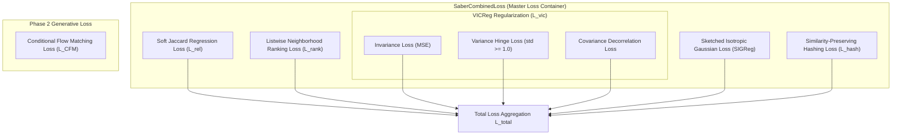
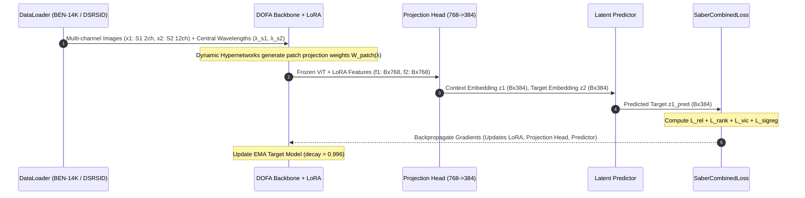
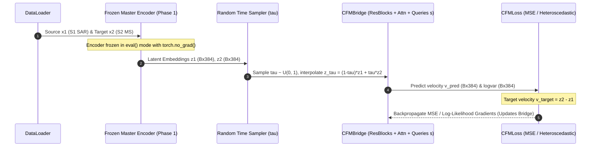
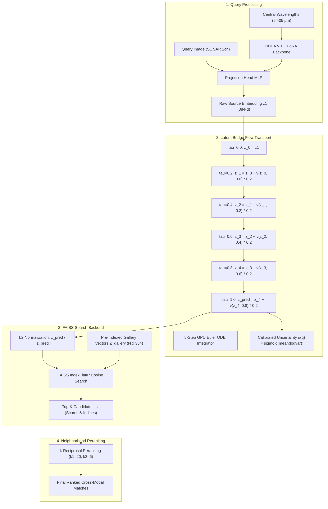

# SABER: Comprehensive Deep-Dive Analysis of Loss Functions and Execution Pathways
### Sensor-Agnostic Bridged Embedding Retrieval (ISRO BAH 2026 · Problem Statement 11)

---

## 📌 Overview

This document provides a complete mathematical, algorithmic, and code-level breakdown of:
1. **The Loss Function Library**: Detailed analysis of every loss objective in SABER, its mathematical formulation, PyTorch code implementation, design rationale, and hyperparameter role.
2. **The End-to-End Execution Pathways**: Step-by-step trace of tensor shapes, module interactions, and data flow across Training Phase 1 (Master Encoder), Training Phase 2 (CFM Latent Bridge), and Inference/Retrieval.

---

## 🧮 Part 1: Detailed Analysis of Loss Functions

SABER employs a multi-task metric-aware loss optimization framework designed to map multi-sensor satellite data (SAR, PAN, MS) into a single unified embedding space without suffering from representation collapse or distribution drift.



---

### 1.1 Soft Jaccard Overlap Regression Loss ($\mathcal{L}_{rel}$)
* **File Location**: [`Saber/losses/saber_loss.py`](file:///c:/Users/praba/OneDrive/Desktop/LFX26/SABER/Saber/losses/saber_loss.py#L77-L95)
* **Purpose**: Aligns continuous embedding cosine similarities directly with ground-truth land-cover Jaccard overlap indices $s_{ij}$. Essential for multi-label remote sensing datasets like BigEarthNet BEN-14K.

#### Mathematical Formulation:
Given target multi-hot vectors $y_i, y_j \in \{0, 1\}^C$, the Jaccard overlap target index $s_{ij}$ is defined as:
$$s_{ij} = \frac{|y_i \cap y_j|}{|y_i \cup y_j|} = \frac{y_i^T y_j}{\|y_i\|_1 + \|y_j\|_1 - y_i^T y_j + \epsilon}$$

The cosine similarity between embedding representations $z_{1i}$ and $z_{2j}$ is:
$$S_{ij} = \frac{z_{1i} \cdot z_{2j}}{\|z_{1i}\|_2 \|z_{2j}\|_2}$$

The Soft Jaccard Loss minimizes the Mean Squared Error (MSE) over off-diagonal sample pairs:
$$\mathcal{L}_{rel} = \frac{1}{N(N-1)} \sum_{i=1}^N \sum_{j \neq i}^N \left( S_{ij} - s_{ij} \right)^2$$

#### PyTorch Code Snippet:
```python
# 1. Compute soft target Jaccard overlap s_ij
intersection = torch.matmul(targets, targets.t())  # (B, B)
sum_y = torch.sum(targets, dim=1, keepdim=True)    # (B, 1)
union = sum_y + sum_y.t() - intersection           # (B, B)
s_ij = intersection / (union + 1e-8)

# Identity mask to exclude self-similarity (i == j)
mask = ~torch.eye(B, dtype=torch.bool, device=device)

# Normalized cosine similarity
z1_norm = F.normalize(z1, p=2, dim=1)
z2_norm = F.normalize(z2, p=2, dim=1)
cos_sim = torch.matmul(z1_norm, z2_norm.t())

# Off-diagonal Jaccard MSE Loss
jaccard_loss = ((cos_sim - s_ij) * mask).pow(2).sum() / (mask.sum() + 1e-8)
```

#### Why It Is Used & Impact:
Standard contrastive losses (e.g., InfoNCE) treat non-identical pairs as purely negative ($s_{ij} = 0$). However, two satellite scenes in BEN-14K often share 3 out of 4 land-cover classes (e.g., both contain "Coniferous Forest" and "Water Bodies"). $\mathcal{L}_{rel}$ forces the metric space distance to mirror real-world ecological overlap.

---

### 1.2 Listwise Neighborhood Ranking Loss ($\mathcal{L}_{rank}$)
* **File Location**: [`Saber/losses/saber_loss.py`](file:///c:/Users/praba/OneDrive/Desktop/LFX26/SABER/Saber/losses/saber_loss.py#L132-L147)
* **Purpose**: Optimizes relative ranking order within local mini-batch neighborhoods using Kullback-Leibler (KL) divergence.

#### Mathematical Formulation:
Converts continuous Jaccard overlaps $s_{ij}$ and embedding cosine similarities $S_{ij}$ into probability distributions over candidates using temperatures $\tau_s$ and $\tau_p$:
$$P_{ij} = \frac{\exp(s_{ij} / \tau_s)}{\sum_{k \neq i} \exp(s_{ik} / \tau_s)}, \quad \hat{P}_{ij} = \frac{\exp(S_{ij} / \tau_p)}{\sum_{k \neq i} \exp(S_{ik} / \tau_p)}$$

The listwise ranking loss minimizes the KL divergence between $P_{ij}$ and $\hat{P}_{ij}$:
$$\mathcal{L}_{rank} = \mathbb{D}_{KL}(P \parallel \hat{P}) = \sum_{i=1}^N \sum_{j \neq i}^N P_{ij} \left( \log P_{ij} - \log \hat{P}_{ij} \right)$$

#### PyTorch Code Snippet:
```python
p_target = F.softmax(s_ij_masked / self.ranking_temp_s, dim=1)
p_pred_logits = F.log_softmax(cos_sim_masked / self.ranking_temp_p, dim=1)

log_p_target = torch.log(p_target + 1e-8)
kl_divergence = p_target * (log_p_target - p_pred_logits)
ranking_loss = kl_divergence.sum(dim=1).mean()
```

#### Why It Is Used:
While $\mathcal{L}_{rel}$ enforces pointwise similarity regression, $\mathcal{L}_{rank}$ optimizes the listwise order of retrieved items, directly boosting Top-$K$ ranking metrics (Precision@5, Recall@5, mAP).

---

### 1.3 VICReg Regularization Losses ($\mathcal{L}_{vic}$)
* **File Location**: [`Saber/losses/vicreg_loss.py`](file:///c:/Users/praba/OneDrive/Desktop/LFX26/SABER/Saber/losses/vicreg_loss.py#L32-L91)
* **Purpose**: Prevents representation collapse (where all embeddings collapse to a single constant vector or low-dimensional subspace).

#### A. Invariance Loss ($\mathcal{L}_{inv}$):
Measures Mean Squared Error between context view $z_1$ and target view $z_2$:
$$\mathcal{L}_{inv} = \frac{1}{N} \sum_{i=1}^N \| z_{1i} - z_{2i} \|_2^2$$

#### B. Variance Regularization Loss ($\mathcal{L}_{var}$):
A hinge loss forcing standard deviation across batch dimension for every embedding dimension $j \in \{1, \dots, d\}$ to be at least $\gamma = 1.0$:
$$\mathcal{L}_{var} = \frac{1}{d} \sum_{j=1}^d \max\left(0, \gamma - \sqrt{\text{Var}(Z_{:, j}) + \epsilon}\right)$$

#### C. Covariance Decorrelation Loss ($\mathcal{L}_{cov}$):
Drives off-diagonal terms of the covariance matrix $C(Z)$ to zero, ensuring feature dimensions encode independent informational attributes:
$$C(Z) = \frac{1}{N-1} \sum_{i=1}^N (z_i - \bar{z})(z_i - \bar{z})^T, \quad \mathcal{L}_{cov} = \frac{1}{d} \sum_{i \neq j} [C(Z)]_{i,j}^2$$

#### PyTorch Code Snippet:
```python
# 1. Invariance Loss
inv_loss = F.mse_loss(z1, z2)

# 2. Variance Hinge Loss
std_z1 = torch.sqrt(z1.var(dim=0) + 1e-4)
std_z2 = torch.sqrt(z2.var(dim=0) + 1e-4)
var_loss = 0.5 * (torch.mean(F.relu(1.0 - std_z1)) + torch.mean(F.relu(1.0 - std_z2)))

# 3. Covariance Decorrelation
z1_centered = z1 - z1.mean(dim=0)
z2_centered = z2 - z2.mean(dim=0)
cov_z1 = (z1_centered.T @ z1_centered) / (batch_size - 1)
cov_z2 = (z2_centered.T @ z2_centered) / (batch_size - 1)

diag_mask = ~torch.eye(num_features, device=z1.device, dtype=torch.bool)
cov_loss = (cov_z1[diag_mask].pow(2).sum() + cov_z2[diag_mask].pow(2).sum()) / (2.0 * num_features)
```

---

### 1.4 Sketched Isotropic Gaussian Regularization ($\mathcal{L}_{sigreg}$)
* **File Location**: [`Saber/losses/sigreg.py`](file:///c:/Users/praba/OneDrive/Desktop/LFX26/SABER/Saber/losses/sigreg.py#L3-L60)
* **Purpose**: Maximum Entropy Cloud Regularization based on LeJEPA Algorithm 1. Forces feature distributions to match isotropic Gaussian characteristic functions without needing explicit negative sample pairs.

#### Mathematical Formulation:
Projects features $x \in \mathbb{R}^{N \times d}$ onto $K=64$ random Cramér-Wold slice directions $A \in \mathbb{R}^{d \times K}$. Computes the Empirical Characteristic Function (ECF) across frequency points $t \in [0, 3]$ and compares it with the standard Gaussian characteristic function $\phi(t) = \exp(-t^2/2)$:
$$\text{ECF}(t) = \frac{1}{N} \sum_{n=1}^N \exp(i t (a_k^T x_n))$$
$$\mathcal{L}_{sigreg} = \frac{1}{K} \sum_{k=1}^K \int_0^3 \left| \text{ECF}_k(t) - e^{-t^2/2} \right|^2 e^{-t^2/2} \, dt$$

#### PyTorch Code Snippet:
```python
# 1. Random Projection Matrix (Cramér-Wold slice directions)
A = torch.randn(C, sketch_dim, device=x.device)
A = A / (A.norm(p=2, dim=0, keepdim=True) + 1e-8)
proj = torch.matmul(x, A)  # (N, sketch_dim)

# 2. Integration Points t_k in [0.0, 3.0]
t = torch.linspace(0.0, 3.0, num_points, device=x.device)
phi = torch.exp(-0.5 * t**2)

# 3. ECF calculation
args = proj.unsqueeze(2) * t.view(1, 1, -1)
ecf_cos = torch.cos(args).mean(dim=0)
ecf_sin = torch.sin(args).mean(dim=0)

diff_sq = (ecf_cos - phi.unsqueeze(0)).pow(2) + ecf_sin.pow(2)
err = diff_sq * phi.unsqueeze(0)

# 4. Numerical Trapezoidal Integration over frequency domain
loss = torch.trapezoid(err, t, dim=-1)
return loss.mean()
```

---

### 1.5 Similarity-Preserving Hashing Loss ($\mathcal{L}_{hash}$)
* **File Location**: [`Saber/models/hashing_head.py`](file:///c:/Users/praba/OneDrive/Desktop/LFX26/SABER/Saber/models/hashing_head.py#L55-L86)
* **Purpose**: Learns compact binary hashing codes ($h(z) \in \{-1, +1\}^m$) for ultra-fast FAISS binary index retrieval while minimizing quantization loss:
$$\mathcal{L}_{hash} = \frac{1}{B^2} \sum_{i,j} \left( \frac{1}{m} h(z_i)^T h(z_j) - s_{ij} \right)^2 + \gamma \frac{1}{B} \sum_i \| |h(z_i)| - 1 \|_2^2$$

---

### 1.6 Conditional Flow Matching Loss ($\mathcal{L}_{CFM}$)
* **File Location**: [`Saber/losses/bridge_loss.py`](file:///c:/Users/praba/OneDrive/Desktop/LFX26/SABER/Saber/losses/bridge_loss.py#L8-L31)
* **Purpose**: Trains the generative latent bridge vector field $v_\phi$ to transport source modality embeddings $z_1$ to target modality embeddings $z_2$ with heteroscedastic uncertainty estimation.

#### Mathematical Formulation:
Given source latent $z_1$ and target latent $z_2$, the target velocity field is straight-path rectilinear:
$$v_{target} = z_2 - z_1$$

The intermediate state at time $\tau \sim U(0, 1)$ is:
$$z_\tau = (1 - \tau) z_1 + \tau z_2$$

The network predicts velocity field $v_{pred}$ and residual log-variance $\text{logvar}$. The heteroscedastic negative log-likelihood loss is:
$$\mathcal{L}_{CFM} = \frac{1}{2} \sum_{j=1}^d \left( e^{-\text{logvar}_j} (v_{pred, j} - v_{target, j})^2 + \text{logvar}_j \right)$$

---

## 🔄 Part 2: End-to-End Execution Pathways

### 2.1 Pathway A: Phase 1 Master Encoder Training
This phase optimizes the DOFA ViT backbone (via LoRA), shared projection heads, predictor, and classifier under pure metric geometry losses.



#### Detailed Execution Steps:
1. **Data Loading**: Batch of multi-sensor stacked images loaded ($[B, 14, 224, 224]$ for BEN-14K). Channels are split into source view $x_1 = x[:, :2, :, :]$ (Sentinel-1 SAR) and target view $x_2 = x[:, 2:, :, :]$ (Sentinel-2 MS).
2. **Dynamic Patch Embedding**: `FrozenDOFABackbone` receives central wavelength vectors ($\lambda_{S1} = [5.405, 5.405]\,\mu\text{m}$, $\lambda_{S2} = [0.443, \dots, 2.190]\,\mu\text{m}$). Wavelength hypernetworks dynamically synthesize patch projection weights.
3. **LoRA Feature Extraction**: Input passes through frozen ViT Transformer blocks. Trainable LoRA rank $r=16, \alpha=32$ adapters operate on `qkv`, `fc1`, and `fc2` modules, returning feature vectors $f_1, f_2 \in \mathbb{R}^{B \times 768}$.
4. **Projection & Prediction**:
   * $z_1 = \text{ProjectionHead}(f_1) \in \mathbb{R}^{B \times 384}$
   * $z_2 = \text{ProjectionHead}(f_2) \in \mathbb{R}^{B \times 384}$
   * $z_{1, pred} = \text{Predictor}(z_1) \in \mathbb{R}^{B \times 384}$
5. **Loss Computation**: `SaberCombinedLoss` evaluates $\mathcal{L}_{rel}, \mathcal{L}_{rank}, \mathcal{L}_{vic}, \mathcal{L}_{sigreg}$.
6. **Optimization**: AdamW updates trainable parameters ($\sim 294.9\text{K}$ parameters). Scaler manages Automatic Mixed Precision (AMP `bfloat16`/`float16`). EMA target model updated with decay rate $0.996$.

---

### 2.2 Pathway B: Phase 2 CFM Latent Bridge Training
This phase trains the continuous generative flow matching bridge to transport source embeddings $z_1$ into target space distribution $z_2$.



#### Detailed Execution Steps:
1. **Feature Freezing**: Master Encoder parameters are frozen (`torch.no_grad()`).
2. **Latent Extraction**: Context embedding $z_1$ and target embedding $z_2$ are extracted for mini-batch items.
3. **Flow Matching Interpolation**:
   * Time step sampled: $\tau \sim U(0, 1)$ of shape $[B, 1]$.
   * Straight probability path computed: $z_\tau = (1 - \tau) z_1 + \tau z_2$.
   * Ground-truth target velocity vector: $v_{target} = z_2 - z_1$.
4. **Velocity & Variance Estimation**: `CFMBridge` network passes $z_\tau$, continuous sinusoidal time embedding $\text{Sinusoidal}(\tau)$, context $z_1$, and shared learnable query anchors $s \in \mathbb{R}^{8 \times 384}$ through interleaved ResBlocks and AttentionBlocks, predicting velocity field $v_{pred}$ and residual log-variance $\text{logvar}$.
5. **Backpropagation**: Gradients derived from $\text{MSE}(v_{pred}, v_{target})$ or heteroscedastic NLL update the CFM bridge weights.

---

### 2.3 Pathway C: Real-Time Cross-Modal Retrieval & Inference
This is the complete end-to-end inference path executed during real-time retrieval queries (e.g. searching Sentinel-2 Multispectral database using a Sentinel-1 SAR query image).



#### Detailed Step-by-Step Inference Trace:
1. **Query Ingestion**: User inputs a query image $x_{query}$ (e.g. Sentinel-1 SAR 2-channel tensor).
2. **Feature Extraction**: $x_{query}$ passed to `get_retrieval_embedding(x)`:
   * Dynamic wavelength patch projection conditions on C-band wavelengths ($5.405\,\mu\text{m}$).
   * Backbone + LoRA extracts 768-d features.
   * Projection head maps to 384-d latent space: $z_1 \in \mathbb{R}^{384}$.
3. **ODE Latent Bridge Integration**:
   * ODE solver initializes state at $\tau = 0$: $z(0) = z_1$.
   * Executes 5-step Euler numerical integration ($\Delta \tau = 0.2$):
     $$z(\tau + \Delta \tau) = z(\tau) + v_\phi(z(\tau), \tau, z_1, s) \cdot \Delta \tau$$
   * Produces aligned target latent descriptor $z_{pred} \in \mathbb{R}^{384}$.
   * Computes query uncertainty $u(q) = \text{sigmoid}(\text{mean}(\log\text{var})) \in [0, 1]$.
4. **L2 Normalization**: Embedding is normalized to unit length: $\hat{z}_{pred} = \frac{z_{pred}}{\|z_{pred}\|_2}$.
5. **FAISS Cosine Vector Search**:
   * $\hat{z}_{pred}$ queried against gallery matrix $Z_{gallery} \in \mathbb{R}^{N \times 384}$ pre-computed for $N$ gallery scenes using `IndexFlatIP`.
   * FAISS returns Top-$K$ candidate indices and initial cosine similarity scores $S_i = \hat{z}_{pred} \cdot z_{gallery, i}$.
6. **$k$-Reciprocal Reranking (Optional)**:
   * Re-evaluates Top-$K$ candidates by checking mutual $k$-nearest neighbors ($k_1=20, k_2=6$).
   * Adjusts cosine distance matrix using Jaccard neighborhood distance, correcting false positives.
7. **Response & Visualization**: Server formats Top-$K$ matching gallery scenes, base64 PNG previews, Jaccard scores, and uncertainty metrics for display on the dashboard.

---

## 📊 Summary Comparison Matrix

| Component / Loss | Input Tensors | Output / Role | Primary Metric Impact |
| :--- | :--- | :--- | :--- |
| **Soft Jaccard Loss ($\mathcal{L}_{rel}$)** | Embeddings $z_1, z_2$, Targets $y_1, y_2$ | Regresses cosine similarity to label overlap | Global mAP, Precision@10 |
| **Listwise Ranking Loss ($\mathcal{L}_{rank}$)** | Cosine matrices, Jaccard target matrices | KL divergence over candidate ranking distributions | Precision@5, Recall@5 |
| **VICReg ($\mathcal{L}_{vic}$)** | Projection vectors $z_1, z_2$ | Variance hinge ($\ge 1.0$) + Covariance decorrelation | Prevents mode collapse |
| **SIGReg ($\mathcal{L}_{sigreg}$)** | Projection vectors $z_1$ | Cramér-Wold random slice characteristic function | Maximum entropy cloud distribution |
| **CFM Bridge Loss ($\mathcal{L}_{CFM}$)** | Velocity $v_{pred}$, Target $z_2 - z_1$, $\text{logvar}$ | Flow matching velocity regression + Uncertainty | Cross-modal retrieval (+19.3 pp) |
| **5-Step Euler ODE Solver** | Source latent $z_1$, Time $\tau$ | Mapped target embedding $z_{pred}$ + Uncertainty $u(q)$ | Sub-30ms execution speed |
