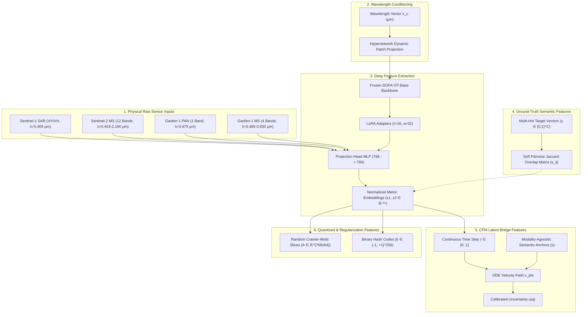

# SABER: Comprehensive Breakdown of Training Features for Cross-Modal Retrieval
### Sensor-Agnostic Bridged Embedding Retrieval (ISRO BAH 2026 · Problem Statement 11)

---

## 📌 Executive Summary

In **SABER** (**S**ensor-**A**gnostic **B**ridged **E**mbedding **R**etrieval), model training for cross-modal satellite image retrieval relies on a multi-tiered hierarchy of features:
1. **Physical & Multi-Sensor Input Features (Raw Data)**: Multi-spectral, SAR, and panchromatic satellite imagery.
2. **Spectral Wavelength Conditioning Features ($\lambda_c$)**: Wavelength floats in micrometers $(\mu\text{m})$ guiding dynamic patch projection hypernetworks.
3. **Ground-Truth Semantic Target Features**: Multi-hot land-cover target vectors and soft Jaccard overlap matrices.
4. **Deep Latent Feature Representations**: Wavelength-conditioned ViT backbone features, parameter-efficient LoRA adapters, projected metric embeddings, and latent predictions.
5. **Stochastic Latent Bridge & Generative Flow Features**: Continuous flow-matching velocity fields, interpolation time steps, shared semantic anchors, and calibrated uncertainty estimates.
6. **Quantized Hash Features & Random Slice Projections**: Binary hash codes for sub-millisecond retrieval and Cramér-Wold random projections for entropy regularization.

---

## 🗂️ Feature Hierarchy Overview

---

## 🛰️ 1. Physical Multi-Sensor Input Features (Raw Data Level)

SABER processes heterogeneous remote sensing modalities. Depending on the dataset, the raw input features consist of different physical spectral and radar bands:

| Dataset | Modality Pair | Channels ($C$) | Wavelengths / Bands ($\lambda_c$) | Spatial Res. | Primary Features |
| :--- | :--- | :--- | :--- | :--- | :--- |
| **BEN-14K** | Sentinel-1 SAR $\rightarrow$ Sentinel-2 MS | **S1**: 2 ch **S2**: 12 ch | **S1**: $\lambda = 5.405\,\mu\text{m}$ (C-band VV, VH) **S2**: $\lambda \in [0.443 \dots 2.190]\,\mu\text{m}$ (12 bands) | $224 \times 224$ | Radar backscatter, dielectric roughness, vegetation red-edge, SWIR moisture |
| **DSRSID** | Gaofen-1 PAN $\rightarrow$ Gaofen-1 MS | **PAN**: 1 ch **MS**: 4 ch | **PAN**: $\lambda = 0.675\,\mu\text{m}$ (High-res single band) **MS**: $\lambda \in [0.485, 0.555, 0.660, 0.830]\,\mu\text{m}$ (BGR + NIR) | $224 \times 224$ | Fine spatial geometry, urban building texture, multispectral vegetation/water |

### Key Input Bands & Physical Properties:
1. **Radar Backscatter Features (Sentinel-1 SAR)**: Dual-polarization VV (vertical transmit / vertical receive) and VH (vertical transmit / horizontal receive) channels capturing surface roughness, soil moisture, and physical structural geometry.
2. **Multispectral Spectral Bands (Sentinel-2 MS & Gaofen-1 MS)**: Coastal Aerosol, Blue, Green, Red, Vegetation Red Edge (B5–B7), Narrow NIR (B8A), Water Vapour (B9), and SWIR (B11–B12) bands capturing biochemical composition, vegetation chlorophyll concentration, and moisture content.
3. **Panchromatic Band (Gaofen-1 PAN)**: High spatial resolution single-channel intensity band ($\lambda_c = 0.675\,\mu\text{m}$) capturing crisp urban structure and land-use shapes.

---

## 🌈 2. Spectral Wavelength Features ($\lambda_c$) (Conditioning Level)

Instead of using hardcoded 3-channel RGB projection weights, SABER incorporates **central wavelength features** $\lambda_c \in \mathbb{R}^C$ measured in micrometers $(\mu\text{m})$:

* **Sentinel-1 (SAR)**: `[5.405, 5.405]`
* **Sentinel-2 (MS)**: `[0.443, 0.490, 0.560, 0.665, 0.705, 0.740, 0.783, 0.842, 0.865, 0.945, 1.610, 2.190]`
* **Gaofen-1 (PAN)**: `[0.675]`
* **Gaofen-1 (MS)**: `[0.485, 0.555, 0.660, 0.830]`

### Role in Training:
The backbone hypernetwork ([wave_dynamic_layer.py](file:///c:/Github/SABER/Saber/dofa/wave_dynamic_layer.py)) accepts these continuous wavelength floats and dynamically generates Vision Transformer (ViT) patch projection weights. This enables **sensor-agnostic feature extraction** across arbitrary sensor band configurations without needing separate backbones.

---

## 🏷️ 3. Ground-Truth Semantic Target Features (Supervision & Evaluation Level)

To evaluate retrieval precision and optionally guide metric space geometry, SABER extracts semantic features from multi-label annotations:

### 3.1 Multi-Label Target Vectors ($y \in \{0, 1\}^C$)
* **BEN-14K (19 CORINE Classes)**: 19-dimensional multi-hot binary vectors representing land-cover presence (e.g., *Urban fabric*, *Coniferous forest*, *Water bodies*, *Arable land*). Defined in [ben14k.py](file:///c:/Github/SABER/Saber/datasets/ben14k.py).
* **DSRSID (8 LULC Classes)**: 8-dimensional multi-hot vectors representing land-use classes (*Aquafarm*, *Forest*, *High building*, *Low building*, *Farm land*, *River*, *Water*, *Cloud*). Defined in [dsrsid.py](file:///c:/Github/SABER/Saber/datasets/dsrsid.py).

### 3.2 Soft Jaccard Overlap Matrix ($s_{ij}$)
During mini-batch evaluation or supervised metric training, pairwise ground-truth similarity matrices are computed using the Jaccard overlap index between sample multi-hot targets $y_i$ and $y_j$:
$$s_{ij} = \frac{|y_i \cap y_j|}{|y_i \cup y_j|} = \frac{y_i^T y_j}{\|y_i\|_1 + \|y_j\|_1 - y_i^T y_j + \epsilon}$$

* **Self-Supervised Pre-Training Mode (Current Active)**: In pure self-supervised mode (`targets=None`), $s_{ij}$ defaults to the identity matrix $\mathbf{I}$, and training relies strictly on **InfoNCE + VICReg (Invariance, Variance, Covariance) + SIGReg**.
* **Supervised Metric Mode (Optional)**: Used when `jaccard_weight > 0` for soft Jaccard regression ($\mathcal{L}_{rel}$) and neighborhood ranking ($\mathcal{L}_{rank}$) in [saber_loss.py](file:///c:/Github/SABER/Saber/losses/saber_loss.py).

---

## 🧠 4. Deep Latent Representations & Feature Maps (Model Level)

During model execution ([saber.py](file:///c:/Github/SABER/Saber/models/saber.py)), raw images are transformed into high-dimensional latent vectors:

1. **Wavelength-Conditioned ViT Features ($h \in \mathbb{R}^{768}$)**:
   Extracted by the frozen DOFA ViT-Base backbone (`FrozenDOFABackbone` in [backbone.py](file:///c:/Github/SABER/Saber/models/backbone.py)). Represents high-level spatial-spectral context after 12 Transformer self-attention layers.
2. **LoRA Parameter-Efficient Adapter Features**:
   Parameter-Efficient Fine-Tuning (LoRA, $r=16, \alpha=32$) is applied strictly to attention query/key/value (`qkv`) projections and MLP layers (`fc1`, `fc2`). These adapters tune representation geometry while keeping 99.74% of backbone weights frozen.
3. **Projected Metric Embeddings ($z_1, z_2 \in \mathbb{R}^{768}$)**:
   Generated by passing backbone features through a 3-layer MLP projection head (`ProjectionHead` in [projection_head.py](file:///c:/Github/SABER/Saber/models/projection_head.py)). These normalized vectors inhabit the metric space where cosine distance mirrors cross-modal similarity.
4. **Predicted Target Latents ($\hat{z}_2 \in \mathbb{R}^{768}$)**:
   Generated by the Latent Predictor network (`Predictor` in [predictor.py](file:///c:/Github/SABER/Saber/models/predictor.py)), estimating target modality features $z_2$ directly from source features $z_1$.

---

## 🌉 5. Stochastic Latent Bridge & Flow Matching Features (Phase 2 Alignment Level)

To solve cross-modal domain shift (e.g., SAR radar backscatter vs. optical multispectral reflectance), Phase 2 trains a **Conditional Flow Matching (CFM) Latent Bridge** ([bridge.py](file:///c:/Github/SABER/Saber/models/bridge.py)):

### Features Used in the Latent Bridge:
1. **Source Latent Embeddings ($z_1 \in \mathbb{R}^{768}$)**: Query radar or panchromatic feature embedding.
2. **Target Latent Embeddings ($z_2 \in \mathbb{R}^{768}$)**: Target multispectral gallery feature embedding.
3. **Continuous Interpolation Time Vector ($\tau \in [0, 1]$)**: Converted via continuous `SinusoidalTimeEmbedding` to positional encodings representing ODE integration time steps.
4. **Velocity Vector ($v_\phi \in \mathbb{R}^{768}$)**: Output of the neural network modeling the probability vector field $v_\phi = \frac{d z_\tau}{d\tau} = z_2 - z_1$.
5. **Modality-Agnostic Semantic Anchors ($s \in \mathbb{R}^{8 \times 768}$)**: Shared learnable query tokens inside `AttentionBlockCFM` in [bridge.py](file:///c:/Github/SABER/Saber/models/bridge.py) that align features across modalities without losing spatial semantics.
6. **Log-Variance & Uncertainty Score ($u(q) \in [0, 1]$)**: Estimated via a residual log-variance head `out_logvar` and calibrated using $u(q) = \text{sigmoid}\left(\frac{1}{d} \sum_j \text{logvar}_j\right)$ to measure translation confidence and scale k-reciprocal re-ranking.

---

## ⚡ 6. Sketched Isotropic Gaussian & Hash Code Features (Search & Regularization)

1. **Random Cramér-Wold Projection Features ($A \in \mathbb{R}^{768 \times 64}$)**:
   Used by **SIGReg** ([sigreg.py](file:///c:/Github/SABER/Saber/losses/sigreg.py)) to project 768-dimensional embeddings onto 64 random 1D slices. The Empirical Characteristic Function (ECF) of these 1D slices is compared against standard Gaussian distributions to prevent feature dimension collapse and normalize embedding density.
2. **Compact Binary Hash Codes ($b \in \{-1, +1\}^{256}$)**:
   Produced by `HashingHead` ([hashing_head.py](file:///c:/Github/SABER/Saber/models/hashing_head.py)) via tanh soft codes $\hat{b} = \tanh(W z + b)$, enabling sub-millisecond Hamming distance retrieval in FAISS when `hashing.enabled: true`.

---

## 📊 Summary Table of Losses & Associated Features

| Loss Objective | Symbol | Key Features Used | Primary Purpose |
| :--- | :--- | :--- | :--- |
| **Cross-Modal InfoNCE** | $\mathcal{L}_{InfoNCE}$ | Latent embeddings ($z_1, z_2$), Temperature ($\tau=0.07$) | 100% Label-free cross-modal directional alignment ($S1 \leftrightarrow S2$) |
| **VICReg (Inv, Var, Cov)** | $\mathcal{L}_{vic}$ | Latent embeddings ($z_1, z_2$), Feature-wise std dev, Covariance matrix | Minimizes $S1 \leftrightarrow S2$ distance ($\mathcal{L}_{inv}$), forces $\text{std} \ge 1$ ($\mathcal{L}_{var}$), and decorrelates features ($\mathcal{L}_{cov}$) |
| **SIGReg Loss** | $\mathcal{L}_{sigreg}$ | Latent embeddings ($z$), Random slice projections ($A \in \mathbb{R}^{768 \times 64}$) | Enforces maximum entropy isotropic Gaussian latent space distribution |
| **CFM Bridge Loss** | $\mathcal{L}_{CFM}$ | Source/target latents ($z_1, z_2$), Velocity field ($v_\phi$), Time steps ($\tau$) | Transports source radar distribution onto optical gallery distribution |
| **Soft Jaccard Loss** | $\mathcal{L}_{rel}$ | Embeddings ($z_1, z_2$), Multi-hot targets ($y$), Soft Jaccard matrix ($s_{ij}$) | Regresses cosine similarity directly to real-world multi-label overlap (Optional Supervised Mode) |
| **Neighborhood Ranking** | $\mathcal{L}_{rank}$ | Embedding similarity logits ($S_{ij}$), Jaccard probabilities ($P_{ij}$) | Optimizes relative retrieval ranking in local mini-batch neighborhoods (Optional Supervised Mode) |
| **Hashing Loss** | $\mathcal{L}_{hash}$ | Soft hash codes ($\hat{b}$), Pairwise target similarity ($s_{ij}$) | Constrains binary codes to preserve metric space similarity in Hamming space (Optional Dev 4) |

