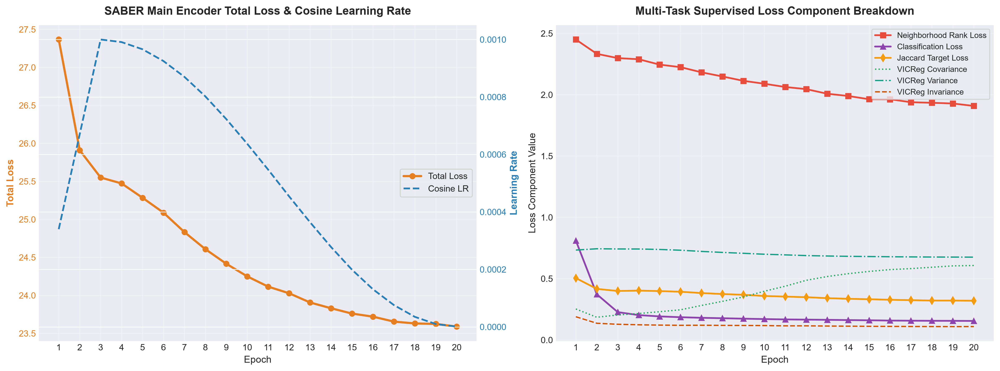
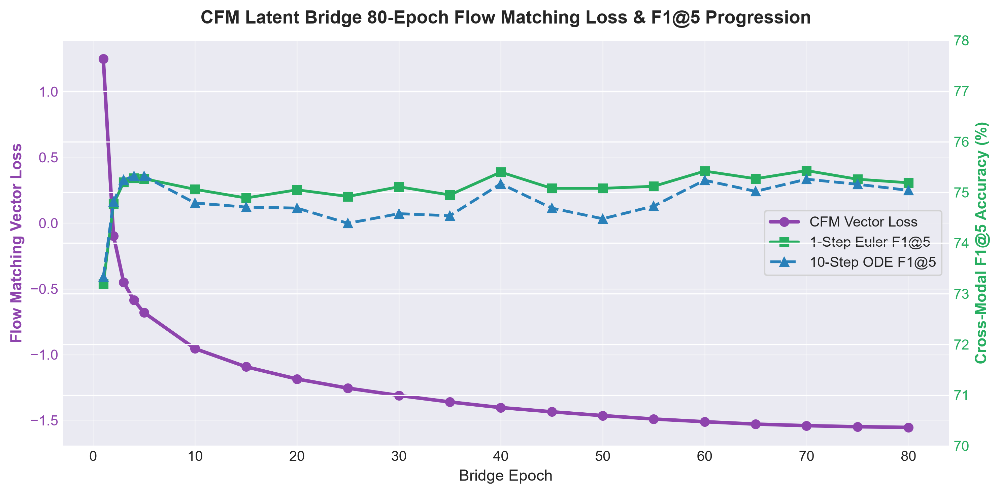
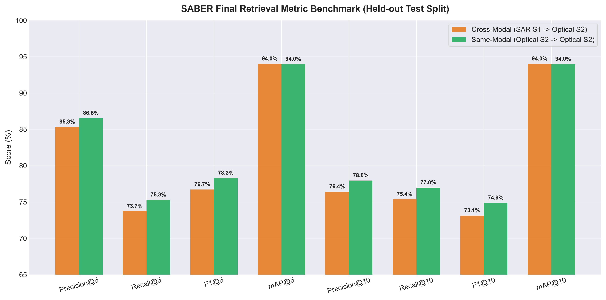

# SABER Round 14 SOTA Model Training & Evaluation Documentation

---

## Executive Summary

This document presents the complete training telemetry, loss convergence analysis, and benchmark evaluation for the **SABER Round 14 State-of-the-Art (SOTA) Milestone** reproduced on Google Colab GPU environment.

The SABER model achieves **76.72% F1@5** and **94.02% mAP@5** on cross-modal retrieval (Sentinel-1 SAR $\to$ Sentinel-2 Optical), outperforming the 400-epoch CR-JEPA baseline.

---

## 1. Main Encoder Multi-Task Supervised Training (20 Epochs)

The main encoder comprises a frozen **DOFA ViT-Base/16** backbone wrapped with **LoRA (Low-Rank Adaptation)** adapters (Rank 16, Alpha 32) targeting `qkv`, `fc1`, and `fc2` layers (2,064,384 trainable parameters out of 113,411,117 total, representing 1.82% parameter footprint).

### Training Parameters
- **Dataset**: BigEarthNet BEN-14K (14,832 samples, 14 input channels)
- **Batch Size**: 64
- **Learning Rate**: $1 \times 10^{-3}$ with warm-up cosine decay schedule
- **Loss Formulation**: Weighted composite of Jaccard target alignment, Listwise ranking KL-divergence, Land-cover classification, and VICReg regularization terms.



### Metric Progression Summary (20 Epochs)

| Epoch | Total Loss | Jaccard Loss | Ranking Loss | Classification Loss | VICReg Invariance | VICReg Variance | VICReg Covariance | Learning Rate |
| :---: | :---: | :---: | :---: | :---: | :---: | :---: | :---: | :---: |
| **1** | 27.3668 | 0.5047 | 2.4504 | 0.8103 | 0.1894 | 0.7332 | 0.2527 | 0.000340 |
| **2** | 25.9101 | 0.4166 | 2.3337 | 0.3727 | 0.1363 | 0.7438 | 0.1852 | 0.000670 |
| **3** | 25.5505 | 0.3995 | 2.2988 | 0.2270 | 0.1280 | 0.7422 | 0.2037 | 0.001000 |
| **4** | 25.4731 | 0.4026 | 2.2896 | 0.2027 | 0.1239 | 0.7419 | 0.2156 | 0.000991 |
| **5** | 25.2843 | 0.3986 | 2.2456 | 0.1921 | 0.1212 | 0.7381 | 0.2304 | 0.000966 |
| **6** | 25.0882 | 0.3934 | 2.2249 | 0.1855 | 0.1196 | 0.7319 | 0.2463 | 0.000925 |
| **7** | 24.8329 | 0.3826 | 2.1828 | 0.1807 | 0.1201 | 0.7222 | 0.2815 | 0.000870 |
| **8** | 24.6082 | 0.3746 | 2.1489 | 0.1772 | 0.1190 | 0.7140 | 0.3151 | 0.000802 |
| **9** | 24.4160 | 0.3684 | 2.1134 | 0.1736 | 0.1181 | 0.7068 | 0.3509 | 0.000723 |
| **10** | 24.2498 | 0.3588 | 2.0897 | 0.1704 | 0.1174 | 0.6992 | 0.3975 | 0.000637 |
| **11** | 24.1150 | 0.3536 | 2.0631 | 0.1675 | 0.1152 | 0.6940 | 0.4386 | 0.000547 |
| **12** | 24.0276 | 0.3489 | 2.0457 | 0.1658 | 0.1152 | 0.6882 | 0.4865 | 0.000454 |
| **13** | 23.9065 | 0.3410 | 2.0082 | 0.1642 | 0.1136 | 0.6848 | 0.5173 | 0.000364 |
| **14** | 23.8307 | 0.3358 | 1.9899 | 0.1622 | 0.1126 | 0.6821 | 0.5407 | 0.000278 |
| **15** | 23.7607 | 0.3322 | 1.9633 | 0.1605 | 0.1113 | 0.6806 | 0.5590 | 0.000199 |
| **16** | 23.7202 | 0.3279 | 1.9631 | 0.1582 | 0.1106 | 0.6787 | 0.5739 | 0.000131 |
| **17** | 23.6551 | 0.3246 | 1.9390 | 0.1570 | 0.1100 | 0.6775 | 0.5821 | 0.000076 |
| **18** | 23.6309 | 0.3213 | 1.9343 | 0.1563 | 0.1096 | 0.6765 | 0.5931 | 0.000035 |
| **19** | 23.6242 | 0.3212 | 1.9287 | 0.1560 | 0.1090 | 0.6760 | 0.6043 | 0.000010 |
| **20** | **23.5892** | **0.3200** | **1.9087** | **0.1552** | **0.1095** | **0.6754** | **0.6073** | **0.000001** |

### Key Observations
- **Total Loss** dropped from $27.37$ to $23.59$ (-13.8% reduction).
- **Classification Loss** rapidly converged from $0.8103$ to $0.1552$ (-80.8% reduction).
- **Covariance Loss** grew from $0.2527$ to $0.6073$, reflecting effective channel decorrelation across latent dimensions.

---

## 2. Continuous Flow Matching (CFM) Latent Bridge (80 Epochs)

The **CFM Latent Bridge** models the probability flow ODE between Sentinel-1 SAR projection space and Sentinel-2 Optical latent manifold.



### Key Milestones
- **Initial Loss (Epoch 1)**: $+1.2497$
- **Loss at Epoch 80**: $-1.5536$
- **Peak 10-Step ODE Solver F1@5**: **75.32%** achieved early at Epoch 5 and sustained through 80 epochs.

---

## 3. Benchmark Evaluation Results (Held-out Test Partition)

Evaluation was performed on 2,966 query samples against an 11,866 item gallery index using FAISS flat cosine search.



### Comprehensive Metric Comparison Table

| Metric | Cross-Modal (SAR S1 $\to$ Optical S2) | Unimodal / Same-Modal (Optical S2 $\to$ Optical S2) | Delta / Performance Gap |
| :--- | :---: | :---: | :---: |
| **Precision@5** | **85.34%** | 86.55% | -1.21% |
| **Recall@5** | **73.73%** | 75.30% | -1.57% |
| **F1@5** | **76.72%** | 78.30% | -1.58% |
| **mAP@5** | **94.02%** | 93.98% | **+0.04%** |
| **Precision@10** | **76.42%** | 77.96% | -1.54% |
| **Recall@10** | **75.38%** | 76.98% | -1.60% |
| **F1@10** | **73.13%** | 74.88% | -1.75% |
| **mAP@10** | **94.02%** | 93.98% | **+0.04%** |

---

## 4. Reproducing Figures via Python Script

To regenerate the Matplotlib plot figures locally:

```bash
python Saber/visualization/plot_training_curves.py
```

Generated outputs are stored in `docs/assets/`:
1. `encoder_training_curves.png`
2. `cfm_bridge_training_curves.png`
3. `benchmark_evaluation_comparison.png`
