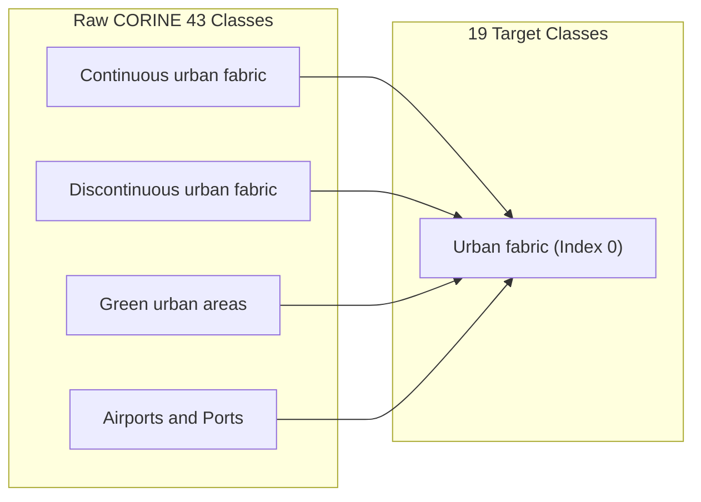
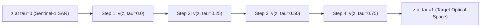

# SABER Technical Guide: BEN-14K Labels & CFM Latent Bridge

This document provides a detailed breakdown of:
1. **The 19-class land-cover label nomenclature used for the BEN-14K dataset**.
2. **The mathematical formulation, architecture, and role of the Conditional Flow Matching (CFM) Latent Bridge**.

---

## Part 1: BEN-14K Land-Cover Label Nomenclature

### Overview
The **BEN-14K** dataset is a benchmark subset derived from **BigEarthNet** (Sentinel-1 SAR radar and Sentinel-2 multispectral optical pair scenes). Satellite patches in BEN-14K are **multi-labeled** — each 120 x 120 patch can contain multiple land-cover categories simultaneously (e.g., both *"Coniferous forest"* and *"Water bodies"*).

SABER uses the **official BigEarthNet 19-class simplified nomenclature** (derived from the original 43 CORINE Land Cover classes).

---

### The 19 Official Land-Cover Categories

In SABER, each scene's ground truth label is encoded as a **19-dimensional multi-hot binary vector** `y` in `{0, 1}^19`:

| Index | Class Name | Description and Typical Features |
|:---:|---|---|
| **0** | Urban fabric | Continuous and discontinuous residential areas, roads, sports facilities |
| **1** | Industrial or commercial units | Factories, commercial complexes, industrial plants, infrastructure |
| **2** | Arable land | Non-irrigated and irrigated agricultural fields, cropland, rice fields |
| **3** | Permanent crops | Vineyards, fruit tree plantations, berry orchards, olive groves |
| **4** | Pastures | Grazing land, enclosed pastures, meadows |
| **5** | Complex cultivation patterns | Heterogeneous mosaic of small cultivated fields and farmsteads |
| **6** | Land principally occupied by agriculture... | Farmland mixed with natural patches of vegetation |
| **7** | Agro-forestry areas | Annual crops under forest canopy or tree cover |
| **8** | Broad-leaved forest | Deciduous hardwood forests (oak, beech, maple) |
| **9** | Coniferous forest | Evergreen needle-leaf forests (pine, fir, spruce) |
| **10** | Mixed forest | Mixed stands of broad-leaved and coniferous species |
| **11** | Natural grassland | Natural unmanaged grass vegetation, dry grassland |
| **12** | Moors and heathland | Low-growing shrubs, heather, dwarf vegetation |
| **13** | Transitional woodland/shrub | Bushy vegetation, clear-cut forest regrowth, shrubland |
| **14** | Beaches, dunes, sands | Bare rock, sand dunes, gravel, river beds, glaciers |
| **15** | Inland wetlands | Inland marshes, bogs, peatlands, non-coastal swamps |
| **16** | Salt marshes | Coastal tidal saltwater marshes |
| **17** | Water bodies | Rivers, lakes, reservoirs, ponds, open sea or coastal waters |
| **18** | Coastal wetlands | Tidal flats, estuaries, lagoons, salt pans |

---

### CORINE 43-Class to 19-Class Aggregation Mapping

Raw BigEarthNet annotations contain 43 detailed CORINE Land Cover (CLC) classes. SABER maps them into the 19 target categories in [ben14k.py](file:///c:/Users/praba/OneDrive/Desktop/LFX26/SABER/Saber/datasets/ben14k.py#L35-L125):



---

### Why Convert 43 CORINE Classes to 19?

Converting the raw 43 CORINE Land Cover (CLC) classes down to 19 target categories is a standard scientific necessity in satellite remote sensing for **three key reasons**:

#### 1. Extreme Class Imbalance & Rare Classes
In the original 43-class CORINE dataset, class frequencies are extremely skewed. Rare categories like *"Glaciers and perpetual snow"*, *"Burnt areas"*, *"Dump sites"*, or *"Mineral extraction sites"* appear in less than **0.01%** of all European satellite scenes. 
- Attempting to evaluate multi-label retrieval metrics (Precision@K, Recall@K, mAP) on classes with almost zero positive samples leads to ill-defined metrics and extreme gradient instability during training.
- Merging sparse sub-classes (e.g., grouping *"Bare rock"*, *"Burnt areas"*, and *"Glaciers"* into *"Beaches, dunes, sands"*) establishes statistically balanced class distributions across dataset splits.

#### 2. Spatial Resolution & Physical Ambiguity (10m - 20m per Pixel)
Sentinel-2 multispectral sensors capture imagery at **10m, 20m, and 60m pixel resolution**. At 10m resolution, fine-grained taxonomies become physically ambiguous:
- Distinguishing *"Continuous urban fabric"* (100% concrete) vs. *"Discontinuous urban fabric"* (80% concrete + 20% trees) or *"Construction sites"* from optical/radar reflectance alone introduces high label noise.
- Merging these highly correlated sub-classes into coherent broad categories (e.g., *"Urban fabric"*, *"Arable land"*) matches the actual physical resolving capability of 10m/20m satellite imagery.

#### 3. Official Remote Sensing Benchmark Standard (Sumbul et al., IEEE TGRS 2021)
In 2021, the creators of BigEarthNet (TU Berlin Computer Vision and Remote Sensing Group) formally published the **BigEarthNet-19 nomenclature standard**.
- They conducted extensive empirical studies on CORINE mapping noise and established 19 classes as the universal benchmark standard.
- By adhering to the official 19-class standard, SABER's retrieval metrics (Precision@K, Recall@K, F1@K, mAP) are **directly comparable to SOTA peer-reviewed research papers** across IEEE TGRS, ISPRS, and CVPR EarthVision benchmarks.

---

## Part 2: Conditional Flow Matching (CFM) Latent Bridge

### The Problem: Sensor Modality Disparity
Synthetic Aperture Radar (**Sentinel-1 SAR**, 2 bands) and Multispectral Optical (**Sentinel-2 MS**, 12 bands) operate on fundamentally different physics:
- **SAR** measures active radar backscatter (dielectric properties, surface roughness, structural geometry).
- **Optical** measures passive solar reflectance across visible, NIR, and SWIR spectrums.

As a result, raw embeddings extracted from Sentinel-1 (`z_S1`) and Sentinel-2 (`z_S2`) live in different manifolds. Standard projection heads (like simple MLPs) suffer from **discretization drift** and collapse under multi-modal distribution shifts.

```
Sentinel-1 SAR Query (z_S1) ---> [ Disparity Gap ] ---> Sentinel-2 MS Gallery Target (z_S2)
```

---

### What is the CFM Latent Bridge?

The **CFM Latent Bridge** ([bridge.py](file:///c:/Users/praba/OneDrive/Desktop/LFX26/SABER/Saber/models/bridge.py)) is a **Continuous Normalizing Flow (CNF)** neural model that maps source radar latents `z1` into target optical latents `z2` along a continuous time trajectory `tau` in `[0, 1]`.

Instead of guessing a single static mapping, the bridge learns a **velocity vector field** `v(z, tau, z1)` that guides the latent trajectory from `tau = 0` (SAR) to `tau = 1` (Optical).



---

### Mathematical Formulation

#### 1. Optimal Transport Interpolation Path
Given source latent `z1` and target optical latent `z2`, the straight-line optimal transport path at time `tau` in `[0, 1]` is:

$$z_\tau = (1 - \tau) z_1 + \tau z_2$$

The ground truth velocity vector along this path is constant:

$$v^*(z_\tau, \tau, z_1) = \frac{d z_\tau}{d\tau} = z_2 - z_1$$

#### 2. Flow Matching Objective
The bridge network `v_theta` is trained using the conditional flow matching loss ([bridge_loss.py](file:///c:/Users/praba/OneDrive/Desktop/LFX26/SABER/Saber/losses/bridge_loss.py)):

$$\mathcal{L}_{\text{CFM}}(\theta) = \mathbb{E}_{\tau \sim U(0,1), (z_1, z_2)} \left[ \left\| v_\theta(z_\tau, \tau, z_1) - (z_2 - z_1) \right\|^2 \right]$$

---

### Neural Network Architecture (`CFMBridge`)

The network architecture consists of interleaved residual blocks and time-conditioned self-attention layers:

```
Input: z_tau (B, D), tau (B, 1), condition_c (B, D)
 |
 |-- Time Encoding: SinusoidalTimeEmbedding(hidden_dim)
 |-- Input Concatenation: Concat(z_tau, condition_c) -> Linear -> hidden_dim
 |-- Block 1: ResBlockCFM + FiLM Modulation (Scale and Shift)
 |-- Block 2: ResBlockCFM
 |-- Block 3: AttentionBlockCFM (Multi-Head Self-Attention with time query bias)
 |-- Block 4: ResBlockCFM
 |-- Block 5: AttentionBlockCFM
 `-- Output Head: Linear -> v(z, tau, c) (Velocity vector prediction)
```

1. **Sinusoidal Time Embedding**: Converts scalar time `tau` in `[0, 1]` into expressive high-dimensional sinusoidal positional encodings.
2. **FiLM Modulation**: Scales and shifts feature activations inside ResBlocks conditioned on time step `tau`.
3. **Multi-Head Self-Attention**: Enforces global context token alignment during trajectory integration.

---

### Inference and ODE Trajectory Integration (`CFMBridgeWrapper`)

During cross-modal retrieval, when a Sentinel-1 query arrives:
1. Encoder extracts source SAR latent `z1 = S1_Projection(Backbone(x_S1))`.
2. The wrapper integrates the ODE `dz/d_tau = v_theta(z, tau, z1)` over `N` discrete steps (`dt = 1/N`):

$$z_{\text{next}} = z_{\text{curr}} + v_\theta(z_{\text{curr}}, \tau, z_1) \cdot \Delta t$$

3. The resulting mapped embedding `z_target` lives in the Sentinel-2 feature space, enabling direct cosine distance comparison against the 10,000+ scene optical gallery index.

---

## Summary Comparison

| Component | Role in SABER | Primary File |
|---|---|---|
| **BEN-14K Labels** | 19-class multi-hot ground truth vectors for multi-label remote sensing land-cover evaluation | [ben14k.py](file:///c:/Users/praba/OneDrive/Desktop/LFX26/SABER/Saber/datasets/ben14k.py) |
| **CFM Latent Bridge** | Continuous flow-matching CNF ODE bridge aligning radar (S1) to optical (S2) feature spaces | [bridge.py](file:///c:/Users/praba/OneDrive/Desktop/LFX26/SABER/Saber/models/bridge.py) |
