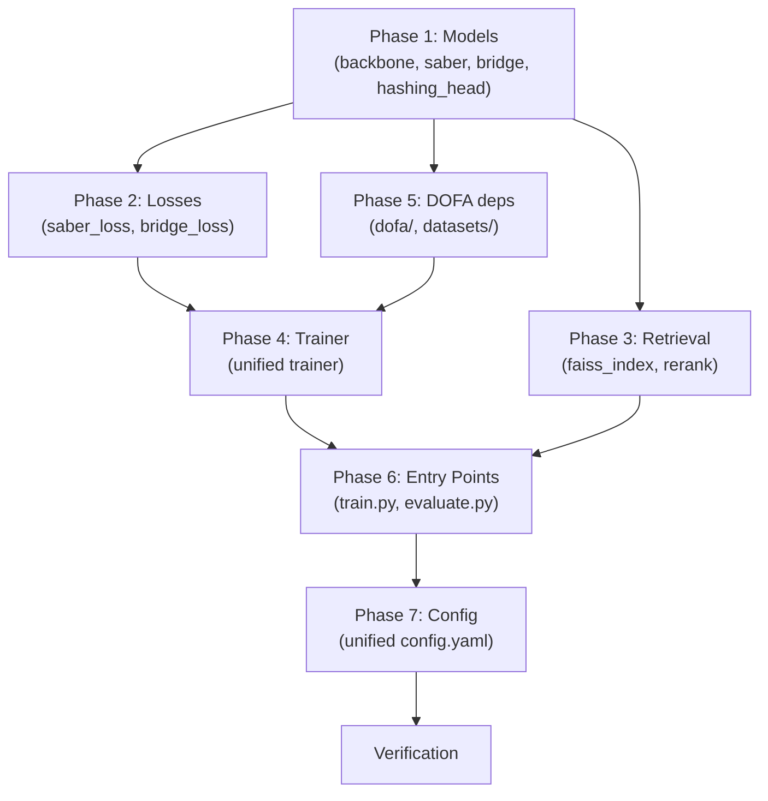

# Integration Plan: Merge All Developer Modules into Unified `Saber/`

We have 4 independently developed and verified modules that must be merged into a single, unified `Saber/` package. This plan defines the exact file-level operations, namespace changes, dependency resolution, and verification strategy.

## Current State

| Module | Owner | Key Contributions | Status |
| :--- | :--- | :--- | :--- |
| `Saber_dofa/` | Dev 1 | DOFA backbone, LoRA adapters, wavelength routing, `saber.py` model | ✅ Trained & Evaluated |
| `Saber_bridge/` | Dev 2 | `CFMBridge` flow-matching predictor, `bridge_loss.py`, EMA target encoder, `train_bridge.py`, `extract_features.py` | ✅ Implemented |
| `Saber_geometry/` | Dev 3 | `SaberCombinedLoss` (Jaccard + Ranking + VICReg), geometry-aware trainer | ✅ Implemented |
| `Saber_retrieval/` | Dev 4 | `HashingHead`, `AdvancedFAISSIndex` (flat/IVFPQ/BinaryHNSW), `ReciprocalReranker`, latency profiler | ✅ Implemented |

**Target**: `Saber/` — the unified production package.

---

## User Review Required

> [!IMPORTANT]
> The integration will **replace** the existing baseline files in `Saber/` (e.g., `rejepa.py`, `backbone.py`, `faiss_index.py`) with the upgraded versions from the developer modules. The original `REJEPA` baseline model class will be preserved alongside the new `SABER` class for backward compatibility.

> [!WARNING]
> All `from Saber_dofa.*`, `from Saber_bridge.*`, `from Saber_geometry.*`, and `from Saber_retrieval.*` import paths will be rewritten to `from Saber.*` in the unified directory. The original developer directories will NOT be deleted (they serve as reference/audit trail).

---

## Open Questions

1. **Config Unification**: Should we create a single unified `config.yaml` that has sections for all modules (bridge, geometry, hashing), or keep the current config and add new sections incrementally? *(Recommendation: single unified config)*
2. **Training Script Strategy**: Should we create a single `train_saber.py` that orchestrates all training phases (encoder → bridge → hashing), or keep separate training scripts for each phase? *(Recommendation: separate scripts, with a master `run_pipeline.py` orchestrator)*

---

## Proposed Changes

### Phase 1: Model Layer Integration

Port all unique model files into `Saber/models/`.

---

#### [KEEP] [backbone.py](file:///c:/Github/SABER/Saber/models/backbone.py)
- Replace with `Saber_dofa/models/backbone.py` (the `FrozenDOFABackbone` that loads DOFA pretrained weights from HuggingFace).
- The old `FrozenViTBackbone` (timm DINO/MAE) becomes the fallback and is kept as `backbone_baseline.py`.

#### [NEW] [saber.py](file:///c:/Github/SABER/Saber/models/saber.py)
- Port from `Saber_dofa/models/saber.py` — the `SABER` class with DOFA backbone, LoRA adapters, wavelength routing, and multi-sensor `_get_wvs_for_channels()`.
- Rewrite all imports from `Saber_dofa.models.*` → `Saber.models.*`.

#### [NEW] [bridge.py](file:///c:/Github/SABER/Saber/models/bridge.py)
- Port from `Saber_bridge/models/bridge.py` — the `CFMBridge` conditional flow-matching velocity field with `TimeEmbedding` and `ResBlockCFM`.
- No import rewrites needed (self-contained, only uses `torch`).

#### [NEW] [hashing_head.py](file:///c:/Github/SABER/Saber/models/hashing_head.py)
- Port from `Saber_retrieval/models/hashing_head.py` — the `HashingHead` with `tanh` relaxation and `similarity_preserving_hash_loss`.
- No import rewrites needed (self-contained).

#### [KEEP] [rejepa.py](file:///c:/Github/SABER/Saber/models/rejepa.py)
- Keep as-is for backward compatibility (baseline REJEPA model).

#### [KEEP] Existing files unchanged:
- `input_adapter.py`, `projection_head.py`, `predictor.py`, `retrieval_head.py`, `vicreg.py`

---

### Phase 2: Loss Functions Integration

Port all unique loss files into `Saber/losses/`.

---

#### [NEW] [saber_loss.py](file:///c:/Github/SABER/Saber/losses/saber_loss.py)
- Port from `Saber_geometry/losses/saber_loss.py` — the `SaberCombinedLoss` with Jaccard regression + listwise ranking + VICReg.
- Rewrite import: `from Saber_geometry.losses.vicreg_loss` → `from Saber.losses.vicreg_loss`.

#### [NEW] [bridge_loss.py](file:///c:/Github/SABER/Saber/losses/bridge_loss.py)
- Port from `Saber_bridge/losses/bridge_loss.py` — the `CFMLoss` heteroscedastic flow-matching loss.
- No import rewrites needed (self-contained).

#### [KEEP] Existing files unchanged:
- `combined_loss.py` (baseline VICReg + prediction loss)
- `prediction_loss.py`
- `vicreg_loss.py`

---

### Phase 3: Retrieval Layer Integration

Port advanced FAISS indexing and re-ranking into `Saber/retrieval/`.

---

#### [MODIFY] [faiss_index.py](file:///c:/Github/SABER/Saber/retrieval/faiss_index.py)
- Replace the simple baseline `FAISSIndex` with the `AdvancedFAISSIndex` from `Saber_retrieval/retrieval/faiss_index.py`.
- This adds: `IndexIVFPQ` (with FastScan), `IndexBinaryHNSW`, `SearchProfile` latency profiler, `pack_binary_codes()`, `random_projection_codes()`.
- Rewrite import: `from Saber_retrieval.retrieval.faiss_index` → `from Saber.retrieval.faiss_index`.

#### [NEW] [rerank.py](file:///c:/Github/SABER/Saber/retrieval/rerank.py)
- Port from `Saber_retrieval/retrieval/rerank.py` — the `ReciprocalReranker` with uncertainty-aware graph re-ranking.
- Rewrite import: `from Saber_retrieval.retrieval.faiss_index import l2_normalize` → `from Saber.retrieval.faiss_index import l2_normalize`.

#### [KEEP] Existing files unchanged:
- `retriever.py`

---

### Phase 4: Trainer Integration

Create a unified trainer that supports all training modes.

---

#### [MODIFY] [trainer.py](file:///c:/Github/SABER/Saber/trainer/trainer.py)
- Merge the EMA target encoder logic from `Saber_bridge/trainer/trainer.py` and the label-aware loss forwarding from `Saber_geometry/trainer/trainer.py`.
- The unified trainer must:
  1. Accept a `training_mode` config flag: `"baseline"` | `"geometry"` | `"bridge"` | `"full_saber"`
  2. Conditionally initialize EMA target model (for bridge mode)
  3. Conditionally forward labels to criterion (for geometry mode)
  4. Log the appropriate loss components per mode

#### [KEEP] Existing files unchanged:
- `evaluator.py`, `metrics.py`

---

### Phase 5: DOFA Dependencies

Port the DOFA backbone dependencies into `Saber/dofa/`.

---

#### [NEW] [dofa/](file:///c:/Github/SABER/Saber/dofa/)
- Copy the entire `Saber_dofa/dofa/` directory (contains `dofa_v1.py`, `wave_dynamic_layer.py`, etc.).
- These are the DOFA ViT model definition and wavelength hypernetwork files loaded by `FrozenDOFABackbone`.

#### [NEW] [datasets/](file:///c:/Github/SABER/Saber/datasets/)
- Copy the updated `ben14k.py` from `Saber_dofa/datasets/ben14k.py` (has the real BigEarthNet reader with `.npy` file loading).
- Keep `dsrsid.py`, `transforms.py`, `base_dataset.py`.

---

### Phase 6: Entry Point Scripts

Port and unify the training/evaluation entry points.

---

#### [MODIFY] [train.py](file:///c:/Github/SABER/train.py) (root-level or `Saber/train.py`)
- Merge the CLI from `Saber_dofa/train.py` to support `--architecture saber|rejepa` flag.
- When `architecture=saber`: instantiate `SABER` model (DOFA + LoRA).
- When `architecture=rejepa`: instantiate `REJEPA` model (baseline).

#### [NEW] [train_bridge.py](file:///c:/Github/SABER/Saber/train_bridge.py)
- Port from `Saber_bridge/train_bridge.py` — standalone bridge training on extracted features.
- Rewrite imports to `Saber.*`.

#### [NEW] [extract_features.py](file:///c:/Github/SABER/Saber/extract_features.py)
- Port from `Saber_bridge/extract_features.py` — extracts S1/S2 embeddings from a frozen encoder and saves as `.npy` for bridge training.

#### [MODIFY] [evaluate.py](file:///c:/Github/SABER/Saber/evaluate.py)
- Merge to support both `SABER` and `REJEPA` model instantiation based on `--architecture` flag.

---

### Phase 7: Config Unification

---

#### [MODIFY] [configs/config.yaml](file:///c:/Github/SABER/Saber/configs/config.yaml)
- Add new sections for all integrated modules:

```yaml
# Bridge Configuration (Dev 2)
bridge:
  enabled: false
  hidden_dim: 512
  num_blocks: 3
  ema_decay: 0.99
  ode_steps: 5

# Geometry Loss Configuration (Dev 3)  
geometry:
  enabled: false
  jaccard_weight: 1.0
  ranking_weight: 1.0
  ranking_temp_s: 0.1
  ranking_temp_p: 0.07

# Hashing & Advanced Retrieval (Dev 4)
hashing:
  enabled: false
  num_bits: 256
  hidden_dim: 512
  quantization_weight: 0.01

retrieval:
  top_k: 5
  metric: "cosine"
  index_type: "flat"        # "flat", "ivfpq", "binary_hnsw"
  index_path: "checkpoints/faiss_index.bin"
  nlist: 64
  pq_m: 64
  pq_bits: 4
  hnsw_m: 32
  nprobe: 8
  fast_scan: false
  rerank_enabled: false
  rerank_shortlist_k: 100
  rerank_neighbor_k: 10
```

---

## Execution Order (Dependency Graph)



---

## Verification Plan

### Automated Tests

1. **Import Smoke Test**: Verify all new modules import cleanly under `Saber.*`:
   ```bash
   python -c "from Saber.models.saber import SABER; from Saber.models.bridge import CFMBridge; from Saber.models.hashing_head import HashingHead; from Saber.losses.saber_loss import SaberCombinedLoss; from Saber.losses.bridge_loss import CFMLoss; from Saber.retrieval.faiss_index import AdvancedFAISSIndex; from Saber.retrieval.rerank import ReciprocalReranker; print('All imports OK')"
   ```

2. **Same-Modal Training Regression**: Re-run the exact training that passed in `Saber_dofa/`:
   ```bash
   python Saber/train.py --architecture saber --dataset_name ben14k --modality s2 --synthetic true --epochs 2
   ```

3. **Same-Modal Evaluation Regression**: Verify retrieval metrics are consistent:
   ```bash
   python Saber/evaluate.py --architecture saber --checkpoint checkpoints/latest.pth --modality s2 --synthetic true
   ```

4. **Bridge Training**: Verify bridge trains on extracted features:
   ```bash
   python Saber/train_bridge.py --features_dir Saber/extracted --epochs 5
   ```

### Manual Verification
- Compare `PRECISION@5`, `RECALL@5`, `F1@5`, `MAP@5` metrics from the unified `Saber/` pipeline against the individual developer module results to ensure no regression.
- Verify that the advanced FAISS index types (`ivfpq`, `binary_hnsw`) build and search correctly.
