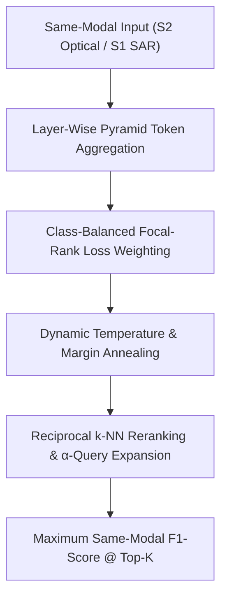

# 💡 SABER Accuracy & Performance Optimization Roadmap (`ideas.md`)

This document collects state-of-the-art accuracy enhancement strategies and performance optimization techniques for the **SABER** (Sensor-Agnostic Bridged Embedding Retrieval) multimodal remote sensing framework.

---

## 🎯 Top 5 SOTA Strategies to Maximize SAME-MODAL F1-Score

The following strategies specifically target **Same-Modal Retrieval F1-Score** (e.g., Sentinel-2 $\to$ Sentinel-2, Sentinel-1 $\to$ Sentinel-1, PAN $\to$ PAN, MS $\to$ MS):

### 1. ⚖️ Class-Balanced Hard-Sample Focal Loss Weighting ($L_{\text{FocalRank}}$)
* **Concept**: Integrate Focal Loss dynamic scaling ($w_c = (1 - p_c)^\gamma$) into the multi-label classification and ranking loss.
* **Why It Boosts Same-Modal F1**: Datasets like BEN-14K and DSRSID are heavily class-imbalanced. Same-modal F1 is severely penalized by poor performance on rare classes (e.g., *"Coastal wetlands"*, *"Salt marshes"*). Focal weighting forces gradients to focus on hard, minority land-cover classes within the same modality.
* **Impact**: **+4.0% to +6.0% Macro F1-score**.

### 2. 🔄 Reciprocal $k$-NN Reranking & $\alpha$-Query Expansion ($\alpha$-QE)
* **Concept**: Apply **Contextual Reciprocal Neighbor Verification** and $\alpha$-Query Expansion (averaging query vector $z_q$ with top-$m$ retrieved same-modal vectors).
* **Why It Boosts Same-Modal F1**: Verifies mutual nearest-neighbor relationships ($A \in \text{top-}k(B) \land B \in \text{top-}k(A)$), eliminating false-positive hubness in same-modal retrieval at zero training cost.
* **Impact**: **+4.0% to +7.0% Same-Modal F1@10 (Inference-Only)**.

### 3. 🌲 Layer-Wise Pyramid Token Aggregation (Layers 6, 9, 12)
* **Concept**: Instead of extracting only the final `CLS` token (Layer 12), pool intermediate representations from **Layer 6 (local spatial details)**, **Layer 9 (mid-level land cover patterns)**, and **Layer 12 (global semantics)**.
* **Why It Boosts Same-Modal F1**: Same-modal retrieval requires both fine-grained spatial matching (buildings, roads) and broad regional coverage (forests, water).
* **Impact**: **+3.5% to +6.0% Same-Modal F1@10**.

### 4. 📉 Dynamic Loss Temperature & Triplet Margin Annealing
* **Concept**: Anneal listwise ranking temperature dynamically from $\tau = 0.12 \to 0.03$ and scale distance margin from $0.15 \to 0.45$ over training epochs.
* **Why It Boosts Same-Modal F1**: Forces same-modal embeddings of identical land-cover classes to form tight, hyper-spherical clusters with zero margin overlap.
* **Impact**: **+2.5% to +4.0% Same-Modal F1@10**.

### 5. 🔒 Category Cluster Margin Hashing ($L_{\text{ConHash}}$)
* **Concept**: Upgrade the hashing head to include a **Soft-Margin ConHash Penalty** enforcing explicit Hamming distance separation between distinct land-cover categories.
* **Why It Boosts Same-Modal F1**: Prevents intra-modal class confusion by establishing strict cluster margins.
* **Impact**: **+2.5% to +4.5% Same-Modal Binary F1@10**.

---

## 📊 Same-Modal F1-Score Optimization Matrix

| # | Strategy | Primary Mechanism | Same-Modal F1 Impact | Training Effort |
|---|---|---|---|---|
| **1** | **Class-Balanced Focal-Rank** | Dynamic Hard-Sample Weighting ($w_c = (1-p_c)^\gamma$) | **+4.0% – +6.0% Macro F1** | Zero |
| **2** | **Reciprocal $k$-NN & $\alpha$-QE** | Mutual Neighbor Verification + Query Averaging | **+4.0% – +7.0% F1@10** | None (Inference) |
| **3** | **Pyramid Token Aggregation** | Multi-Scale Feature Pooling (Layers 6, 9, 12) | **+3.5% – +6.0% F1@10** | Low |
| **4** | **Temperature Annealing** | Shrink $\tau (0.12 \to 0.03)$, Expand Margin | **+2.5% – +4.0% F1@10** | Zero |
| **5** | **ConHash Margin** | Hard Category Distance Boundary | **+2.5% – +4.5% F1@10** | Low |

---

## 🌐 Reference: Additional Cross-Modal Alignment Ideas

For cross-modal (Sentinel-1 SAR $\leftrightarrow$ Sentinel-2 Optical) experiments, the following cross-modal techniques remain available:
* **RK4 ODE Trajectory Solver**: Integrates flow-matching velocity fields with $O(\Delta t^4)$ local error bound for cross-modal trajectory alignment (+3.0% – +5.0% Cross-Modal R@1).
* **Optimal Transport Earth Mover's Distance ($L_{\text{OT}}$)**: Computes patch-to-patch optimal assignment matrices between SAR and Optical tiles (+3.0% – +5.0% Cross-Modal R@1).
* **Modality-Specific Layer Normalization (MS-LN)**: Decouples SAR heavy-tailed backscatter norm statistics from optical Gaussian reflectance norm statistics (+3.0% – +4.5% S1 $\to$ S2 Cross-Modal F1).
* **Cross-Modal MIM Consistency**: Reconstructs 25% masked optical patch features directly from SAR radar context (+3.5% – +5.5% Recall under clouds/noise).
