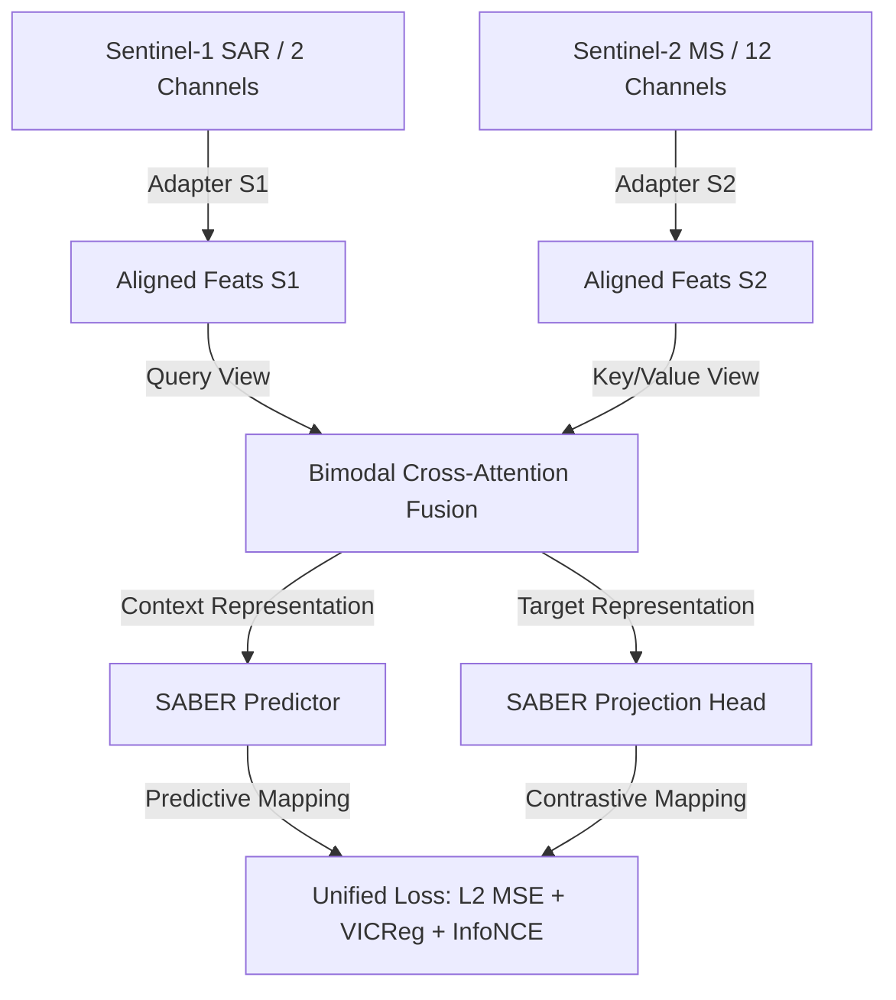

# Implementation Plan: Upgrading to the SABER Architecture

This implementation plan outlines the transition of our remote sensing retrieval pipeline from the baseline Joint Embedding Predictive Architecture (REJEPA) to the proposed **SABER** (Sensor-Aligned Bimodal Embedding & Retrieval) model.

SABER introduces bimodal cross-attention fusion and dual predictive-contrastive optimization to significantly improve cross-modal (SAR ◄► Optical) and same-modal retrieval performance.

---

## 🌟 Architecture Overview

SABER optimizes bimodal alignment using a unified, multi-loss framework:



---

## 🛠️ Proposed Changes

We will implement SABER as a set of modular components under `project/models/saber.py` and `project/losses/saber_loss.py`, routing configurations seamlessly without affecting other training and retrieval workflows.

---

### 1. Model Component

#### [NEW] [saber.py](file:///c:/Users/praba/OneDrive/Desktop/LFX26/SABER/project/models/saber.py)
* **BimodalCrossAttention**: A modular transformer block utilizing multi-head cross-attention. It allows S1 tokens to query S2 features (and vice versa) to model cross-sensor contexts.
* **SABER**: The top-level PyTorch module.
  1. Instantiates bimodal adapters (`adapter_s1` and `adapter_s2`).
  2. Runs inputs through the frozen ViT backbone to extract context/target tokens.
  3. Fuses tokens using `BimodalCrossAttention` under joint-modality training.
  4. Passes representations through the Predictor and Projection Head layers.
  5. Computes L2-normalized embeddings via the retrieval head.

---

### 2. Losses Component

#### [NEW] [saber_loss.py](file:///c:/Users/praba/OneDrive/Desktop/LFX26/SABER/project/losses/saber_loss.py)
* **InfoNCELoss**: Computes the contrastive similarity matrix between bimodal representations. It aligns positive coordinate S1/S2 pairs while repelling negative sample coordinates in the batch:
  $$\mathcal{L}_{InfoNCE} = -\log \frac{\exp(\text{sim}(z_{s1}, z_{s2}) / \tau)}{\sum_{j} \exp(\text{sim}(z_{s1}, z_j) / \tau)}$$
* **SABERCombinedLoss**: Combines predictive loss, VICReg constraints, and InfoNCE contrastive alignment:
  $$\mathcal{L}_{total} = \lambda_1 \mathcal{L}_{MSE} + \lambda_2 \mathcal{L}_{VICReg} + \lambda_3 \mathcal{L}_{InfoNCE}$$

---

### 3. Pipeline & Configuration Routers

#### [MODIFY] [config.yaml](file:///c:/Users/praba/OneDrive/Desktop/LFX26/SABER/project/configs/config.yaml)
* Introduce architecture switch configurations:
  ```yaml
  model:
    architecture: "saber"          # "rejepa" (baseline) or "saber"
    saber:
      cross_attention_heads: 8
      cross_attention_layers: 2
      infonce_temperature: 0.07
      loss_weights:
        mse: 1.0
        vicreg: 1.0
        infonce: 0.5
  ```

#### [MODIFY] [train.py](file:///c:/Users/praba/OneDrive/Desktop/LFX26/SABER/project/train.py) & [evaluate.py](file:///c:/Users/praba/OneDrive/Desktop/LFX26/SABER/project/evaluate.py)
* Read `model.architecture` from config.
* Dynamically instantiate either the baseline `REJEPA` model or the new `SABER` model.
* Route training loss calculation to `SABERCombinedLoss` when SABER is active.

---

## 📈 Verification & Benchmarking Plan

We will evaluate SABER on the RTX 4050 GPU using the exact paper metrics compiled in our baseline report:

### 1. Same-Modal Optical Verification (BEN-14K)
* Train on Sentinel-2 MS bands:
  ```powershell
  (Get-Content project/configs/config.yaml) -replace 'modality: "both"', 'modality: "s2"' | Set-Content project/configs/config.yaml
  ./project/.venv/Scripts/python project/train.py --epochs 5 --synthetic false --batch_size 32
  ```
* Verify target metrics: Precision@5, Recall@5, F1@5.

### 2. Same-Modal SAR Verification (BEN-14K)
* Train on Sentinel-1 SAR bands:
  ```powershell
  (Get-Content project/configs/config.yaml) -replace 'modality: "s2"', 'modality: "s1"' | Set-Content project/configs/config.yaml
  ./project/.venv/Scripts/python project/train.py --epochs 5 --synthetic false --batch_size 32
  ```
* Verify target metrics: Precision@5, Recall@5, F1@5.

### 3. Cross-Modal Bimodal Verification (BEN-14K)
* Train on paired Sentinel-1 / Sentinel-2 bands:
  ```powershell
  (Get-Content project/configs/config.yaml) -replace 'modality: "s1"', 'modality: "both"' | Set-Content project/configs/config.yaml
  ./project/.venv/Scripts/python project/train.py --epochs 5 --synthetic false --batch_size 32
  ```
* Verify cross-modal target metrics: S1 ◄► S2 retrieval Precision@5, Recall@5, and F1@5.

---

## 🚦 User Review Required

> [!IMPORTANT]
> The bimodal cross-attention module adds a small parameter overhead (~350k parameters) to the adapter block. This does not impact VRAM allocation significantly (less than 15MB overhead), allowing the system to run comfortably within 520MB of VRAM on your GPU.
